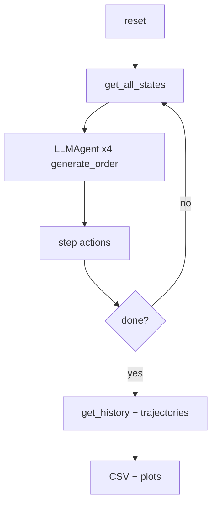

# Architecture

This repository implements a local Beer Game replication framework with decentralized LLM agents, classical baselines, and repeated-run reliability experiments.

---

## Table of Contents

1. [System Overview](#1-system-overview)
2. [Beer Game Dynamics](#2-beer-game-dynamics)
3. [Simulator Layer](#3-simulator-layer)
4. [LLM Agent Layer](#4-llm-agent-layer)
5. [Trajectory Logging](#5-trajectory-logging)
6. [Reward Shaping](#6-reward-shaping)
7. [Metrics](#7-metrics)
8. [Experiment Pipeline](#8-experiment-pipeline)
9. [API Reference](#9-api-reference)
10. [Folder Structure](#10-folder-structure)
11. [Data Flow](#11-data-flow)
12. [Ollama / Backend Interaction](#12-ollama--backend-interaction)
13. [Future / Not Implemented](#13-future--not-implemented)

---

## 1. System Overview

The framework has four cooperating layers:

- `simulator/` — Beer Game environment and state transition logic.
- `agents/` — local LLM agent wrappers and backend adapters.
- `policies/` — classical policy implementations for baseline comparisons.
- `evaluation/` — repeated-run experiments, metric computation, and plotting.

**Design principles:**

- **Modularity** — separate simulator, agents, metrics, and experiments.
- **Decentralization** — agents act on local information unless the orchestrator shares data.
- **Reproducibility** — fixed-demand paths, demand seeds, and explicit output directories.
- **Research focus** — repeated-run variability and bullwhip amplification rather than production RL training.

---

## 2. Beer Game Dynamics

### Supply chain topology

```
Customer ──demand──► Retailer ──order──► Wholesaler ──order──► Distributor ──order──► Factory
                         ▲                  ▲                    ▲                  ▲
                         └── shipments ───┴── shipments ───────┴── shipments ─────┘
```

Each echelon is a `SupplyChainNode`.

| Parameter           | Default | Role                                                |
| ------------------- | ------- | --------------------------------------------------- |
| `initial_inventory` | 20      | Starting on-hand stock                              |
| `lead_time`         | 2       | FIFO pipeline depth for incoming shipments         |
| `holding_cost`      | 1.0     | Cost per unit held in inventory per week            |
| `backlog_cost`      | 2.0     | Cost per unit of unmet demand per week              |

### Weekly `step()` sequence

`BeerGame.step(actions)` executes in this fixed order:

1. Receive shipments from the pipeline into inventory.
2. Generate customer demand from the configured demand generator.
3. Fulfill demand by shipping available inventory and updating backlog.
4. Advance shipments downstream via per-node pipelines.
5. Load the factory pipeline with the factory's last order.
6. Apply each node's action via `place_order()`.
7. Compute per-node holding and backlog costs.
8. Record history, bullwhip, and trajectories.
9. Compute shaped reward via configured weights.
10. Return next state, reward, done, and info.

---

## 3. Simulator Layer

### `SupplyChainNode` (`simulator/node.py`)

Encapsulates one supply-chain echelon.

| Method                     | Purpose                                                  |
| -------------------------- | -------------------------------------------------------- |
| `reset()`                  | Reset inventory, backlog, pipeline, and history           |
| `receive_shipment()`       | Pop FIFO pipeline shipment and add to inventory          |
| `add_incoming_shipment()`  | Append shipment to pipeline for future arrival           |
| `fulfill_demand(d)`        | Serve demand/backlog and compute new backlog             |
| `place_order(q)`           | Record the new order and save last order                 |
| `compute_costs()`          | Calculate holding + backlog costs                        |
| `get_state()`              | Raw state dict for debugging and visualization           |

### `BeerGame` (`simulator/beer_game.py`)

Controls simulation progression.

Key methods:

- `reset()` — clears state, history, and trajectories.
- `step(actions)` — advances one week.
- `get_state(agent_name=None)` — raw agent/full state.
- `get_state_dict(agent_name)` — observation dictionary for a single agent.
- `get_all_states()` — all local observations.
- `get_agent_state(agent_name)` — augmented state with orchestrator sharing.
- `get_global_state()` — centralized snapshot.
- `get_history()` — time-series of system state.
- `get_trajectories()` — standardized rollout records.
- `compute_bullwhip()` — order-to-demand amplification ratios.

### Shared state and orchestrator modes

The orchestrator supports shared information regimes.

- `DECENTRALIZED` — no shared observability.
- `DEMAND_SHARING` — share current customer demand.
- `HISTORY_SHARING` — share demand history and volatility.
- `CENTRALIZED` — share system-level backlog/inventory and per-echelon snapshots.
- `NEGOTIATION` — multi-stage decision proposals and revision context in `evaluation/repeated_runs.py`.

`BeerGame.get_agent_state()` returns the augmented local observation when orchestrator sharing is enabled.

---

## 4. LLM Agent Layer

### `LLMAgent` (`agents/llm_agent.py`)

Each echelon uses a dedicated `LLMAgent` instance.

Pipeline:

1. Build structured prompt from the agent state.
2. Query the selected backend (`ollama` or `groq`).
3. Parse the returned text for an integer order.
4. Clamp the order to a valid range.
5. Return a safe integer action.

The agent also supports:

- tool recommendation input via `tools/inventory_tool.py`
- negotiation context when orchestrator `NEGOTIATION` mode is active
- majority-vote sampling via `generate_order_majority_vote()`

### Backend support

- `OllamaBackend` — default.
- `GroqBackend` — supported by `agents.llm_backends`.

### Output parsing

The parser prefers explicit integer patterns such as:

- `order: 42`
- `Answer: 18`
- fenced code blocks containing a number

It falls back to the last standalone positive integer and clamps any value to `[0, max_order]`.

---

## 5. Trajectory Logging

Each step adds one trajectory record per echelon.

A trajectory record includes:

- `week`
- `agent`
- `state`
- `action`
- `reward`
- `next_state`
- `cost`
- `bullwhip`

Use `env.get_trajectories()` to retrieve rollout records.

---

## 6. Reward Shaping

The shaped reward is computed from system cost, bullwhip, and backlog.

```python
R_t = - (alpha * total_cost + beta * bullwhip_overall + gamma * total_backlog)
```

Default weights are:

- `alpha = 1.0`
- `beta = 0.1`
- `gamma = 0.5`

`BeerGame.step()` returns an `info` dictionary containing reward, costs, and bullwhip data.

---

## 7. Metrics

### Bullwhip

`metrics/bullwhip.py` computes order amplification as:

```python
BW_k = Var(orders_k) / Var(customer_demand)
```

### Agent bullwhip

`metrics/agent_bullwhip.py` computes across-run agent bullwhip metrics, including per-echelon summaries.

### Reliability and cost

- `metrics/reliability.py`
- `metrics/cost_analysis.py`
- `metrics/stability.py`

---

## 8. Experiment Pipeline

### Supported scripts

| Script                               | Purpose                                                |
| ------------------------------------ | ------------------------------------------------------ |
| `main.py`                            | CLI wrapper for experiments and validation             |
| `experiments/llm_experiment.py`      | Single-run LLM experiment and plot generation          |
| `experiments/baseline_experiment.py` | Classical baseline policy experiment                   |
| `experiments/run_majority_vote.py`   | Majority-vote repeated-run experiments                 |
| `experiments/run_figure2.py`         | Generate Figure 2 boxplots                             |
| `experiments/run_figure3.py`         | Generate Figure 3 plots from two result folders        |
| `experiments/test_llm_agent.py`      | LLM parsing and behavior tests                         |
| `experiments/test_state_api.py`      | State API smoke tests                                  |
| `experiments/smoke_test.py`          | Minimal integration smoke test                         |
| `evaluation/compare_models.py`       | Repeated model comparison evaluation                   |
| `evaluation/repeated_runs.py`       | Paper-aligned repeated-run experiment engine           |

### Repeated-run experiment

`evaluation/repeated_runs.py` executes repeated episodes with the same demand path and exports:

- run histories
- total cost summaries
- metric reports
- JSONL trajectories
- optionally LLM and heuristic policies

---

## 9. API Reference

### RL observation (`get_state_dict`)

```python
{
    "inventory": int,
    "backlog": int,
    "incoming_shipments": int,
    "pipeline_inventory": int,
    "last_customer_demand": int,
    "last_order": int,
    "current_week": int,
}
```

### `step(actions)` contract

```python
actions = {
    "Retailer": int,
    "Wholesaler": int,
    "Distributor": int,
    "Factory": int,
}
next_state, reward, done, info = env.step(actions)
```

Missing keys default to `0`.

---

## 10. Folder Structure

```
ai_supplychain/
├── simulator/
│   ├── beer_game.py
│   ├── environment.py
│   ├── config.py
│   ├── demand.py
│   ├── rewards.py
│   ├── orchestrator.py
│   └── node.py
├── configs/
├── trajectories/
├── docs/
├── agents/
│   ├── llm_agent.py
│   ├── llm_backends.py
│   └── constraints.py
├── policies/
├── metrics/
├── evaluation/
├── experiments/
├── results/
├── plots/
├── main.py
├── requirements.txt
├── README.md
├── SETUP.md
└── ARCHITECTURE.md
```

---

## 11. Data Flow



---

## 12. Ollama / Backend Interaction

### Ollama request shape

```
POST {ollama_url}/api/generate
Content-Type: application/json

{
  "model": "<model_name>",
  "prompt": "<built prompt>",
  "stream": false,
  "options": {"temperature": 0.2, "num_predict": 8}
}
```

### Error handling

- connection errors return `None`
- timeouts return `None`
- parse failures fall back to the heuristic/default order

---

## 13. Future / Not Implemented

Missing repo capabilities:

- dedicated Gymnasium adapter
- RL training loops or GRPO/PPO pipeline
- human baseline dataset and explicit paper comparisons
- Law of Total Variance decomposition
- dedicated Figure 4 / Figure 5 post-training workflows

For installation and usage, see `SETUP.md` and `README.md`.
