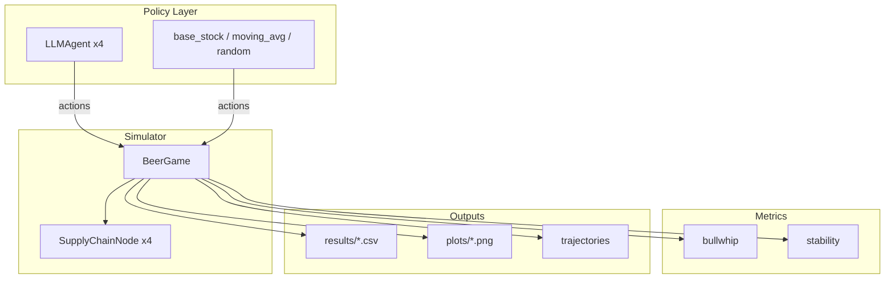
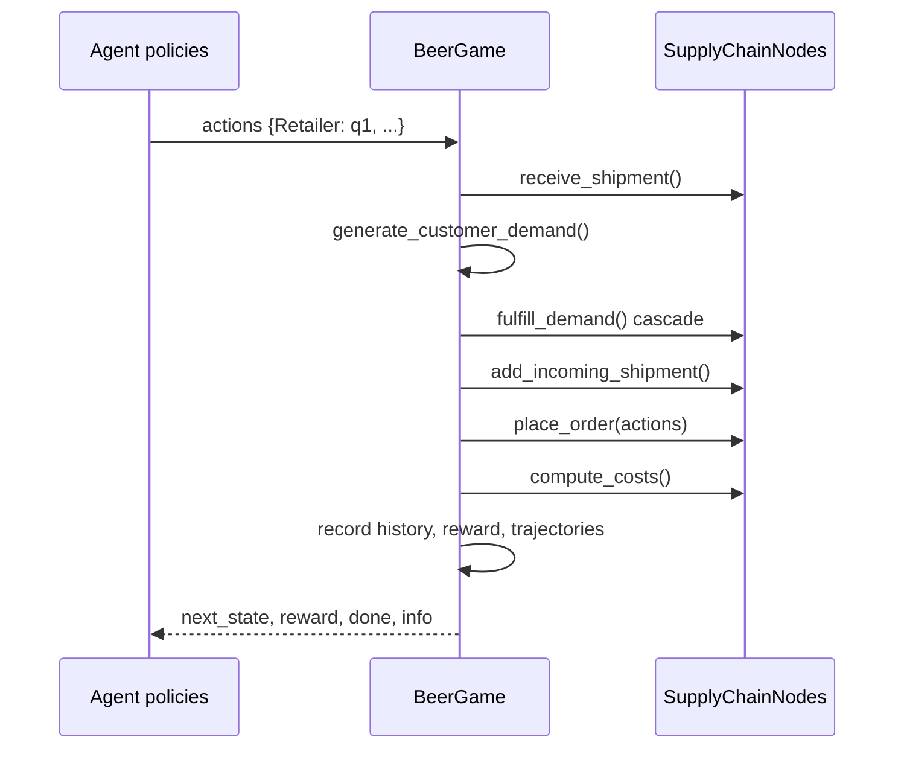
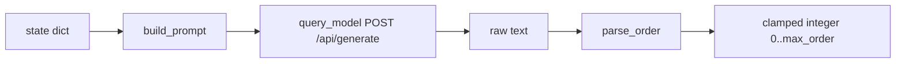
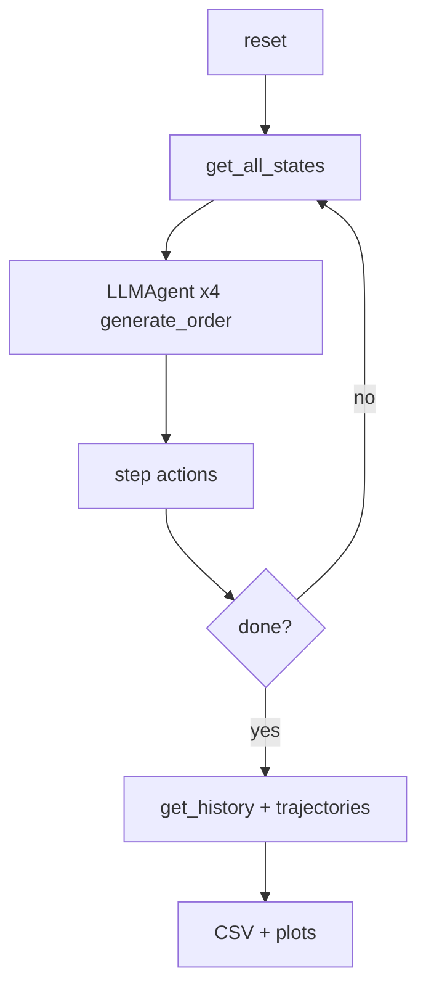

# Architecture

Technical reference for the AI Supply Chain Beer Game framework. All descriptions match the **current codebase**—no planned components are documented as implemented.

---

## Table of Contents

1. [System Overview](#1-system-overview)
2. [Beer Game Dynamics](#2-beer-game-dynamics)
3. [Simulator Layer](#3-simulator-layer)
4. [LLM Agent Layer](#4-llm-agent-layer)
5. [Trajectory Logging](#5-trajectory-logging)
6. [Reward Shaping](#6-reward-shaping)
7. [Metrics](#7-metrics)
8. [Experiment Pipeline](#8-experiment-pipeline)
9. [API Reference](#9-api-reference)
10. [Folder Structure](#10-folder-structure)
11. [Data Flow](#11-data-flow)
12. [Ollama Interaction](#12-ollama-interaction)
13. [Future RL / PPO / GRPO](#13-future-rl--ppo--grpo)

---

## 1. System Overview

The framework has four cooperating layers:



**Design principles:**

- **Modularity** — simulator, agents, policies, and metrics are separate packages.
- **Decentralization** — each echelon observes only local state; no inter-agent messaging.
- **RL compatibility** — `reset()` / `step(actions)` API, structured observations, trajectory store.
- **Reproducibility** — seeded experiments, CSV exports, optional plotting.

---

## 2. Beer Game Dynamics

### Supply chain topology

```
Customer ──demand──► Retailer ──order──► Wholesaler ──order──► Distributor ──order──► Factory
                         ▲                  ▲                    ▲                  ▲
                         └── shipments ───┴── shipments ───────┴── shipments ─────┘
```

Each echelon is a `SupplyChainNode` with:

| Parameter           | Default | Role                                                |
| ------------------- | ------- | --------------------------------------------------- |
| `initial_inventory` | 20      | Starting on-hand stock                              |
| `lead_time`         | 2       | FIFO pipeline length (weeks until shipment arrives) |
| `holding_cost`      | 1.0     | Cost per unit in inventory per week                 |
| `backlog_cost`      | 2.0     | Cost per unit of unmet demand per week              |

### Weekly `step()` sequence

`BeerGame.step(actions)` executes in this fixed order:

```
1. Receive shipments     → pop left of incoming_shipments deque → add to inventory
2. Generate demand       → random integer in [2, 8] at retailer only
3. Fulfill demand        → cascade: retailer←customer, wholesaler←retailer order, etc.
4. Ship downstream       → push shipped qty into downstream pipeline
5. Factory production    → factory order becomes production entering factory pipeline
6. Place orders          → actions dict applied via node.place_order()
7. Compute costs         → holding + backlog per node; sum to total_system_cost
8. Record history        → demand, orders, inventory, backlog, costs, bullwhip
9. Shape reward          → cost + bullwhip + backlog penalty
10. Log trajectories     → per-agent (s, a, r, s')
11. Increment week       → done when week >= max_weeks
```



### Customer demand

`generate_customer_demand()` returns `random.randint(2, 8)` each week. There is no external demand dataset in the current implementation.

---

## 3. Simulator Layer

### `SupplyChainNode` (`simulator/node.py`)

Dataclass encapsulating one echelon.

| Method                     | Purpose                                                  |
| -------------------------- | -------------------------------------------------------- |
| `reset()`                  | Restore inventory, empty backlog, zero pipeline          |
| `receive_shipment()`       | FIFO pop → inventory                                     |
| `add_incoming_shipment(q)` | FIFO push (arrives after `lead_time` weeks)              |
| `fulfill_demand(d)`        | Ship min(inventory, demand+backlog); remainder → backlog |
| `place_order(q)`           | Set `last_order`, append to `order_history`              |
| `compute_costs()`          | `inventory * holding_cost + backlog * backlog_cost`      |
| `get_state()`              | Raw dict: inventory, backlog, pipeline list, last_order  |

### `BeerGame` (`simulator/beer_game.py`)

Environment orchestrator.

**Constructor:**

```python
BeerGame(
    max_weeks=50,
    verbose=False,
    alpha=1.0,   # cost weight
    beta=0.1,    # bullwhip weight
    gamma=0.5,   # backlog weight
)
```

**Core methods:**

| Method                       | Returns                            | Description                                  |
| ---------------------------- | ---------------------------------- | -------------------------------------------- |
| `reset()`                    | state                              | New episode; clears history and trajectories |
| `step(actions)`              | `(next_state, reward, done, info)` | Advance one week                             |
| `get_state(agent_name=None)` | dict                               | Per-agent RL dict or all raw node states     |
| `get_state_dict(agent_name)` | dict                               | RL observation for one echelon               |
| `get_all_states()`           | dict                               | All echelons' RL observations                |
| `get_history()`              | dict                               | Time series for analysis                     |
| `get_trajectories()`         | list                               | Rollout transitions                          |
| `compute_bullwhip()`         | dict                               | Per-agent and overall ratios                 |

**Plotting** (requires matplotlib): `plot_orders_vs_demand`, `plot_inventory`, `plot_backlog`, `plot_inventory_and_backlog`.

---

## 4. LLM Agent Layer

### `LLMAgent` (`agents/llm_agent.py`)

One instance per echelon; **no shared context** between agents.



| Method                            | Description                                          |
| --------------------------------- | ---------------------------------------------------- |
| `build_prompt(state)`             | Natural-language prompt from local observation       |
| `query_model(prompt)`             | HTTP POST to Ollama; returns response text or `None` |
| `parse_order(text, default)`      | Regex extraction; reasoning-model safe               |
| `generate_order(state, fallback)` | Full pipeline: prompt → query → parse                |

**Configuration:**

| Parameter     | Default                  |
| ------------- | ------------------------ |
| `model_name`  | `qwen:1.5b`              |
| `ollama_url`  | `http://localhost:11434` |
| `max_order`   | 100                      |
| `temperature` | 0.2                      |
| `timeout`     | 120.0 seconds            |

**Parsing strategy** (for reasoning models):

1. Match explicit patterns (`order: 42`, `Answer: 18`, etc.)
2. Else use **last standalone positive integer** in the response
3. Reject negatives near the matched digit
4. Clamp to `[0, max_order]`; return `default` on failure

---

## 5. Trajectory Logging

After each `step()`, the simulator appends **one record per echelon** to `env.trajectories`:

```python
{
    "week": int,           # week index before increment
    "agent": str,          # "Retailer" | "Wholesaler" | ...
    "state": dict,         # pre-step get_state_dict()
    "action": int,         # order placed
    "reward": float,       # shared shaped reward (system-level)
    "next_state": dict,    # post-step get_state_dict()
    "cost": float,         # total_system_cost this week
    "bullwhip": float|None # overall bullwhip at this step
}
```

Access via `env.get_trajectories()` (returns a shallow copy).

**RL note:** Reward is currently **shared** across agents (full supply chain penalty). Per-agent reward decomposition is not implemented.

Episode length: `4 agents × max_weeks` transitions.

---

## 6. Reward Shaping

### Formula

\[
R_t = -\big(\alpha \cdot C_t + \beta \cdot B_t + \gamma \cdot L_t\big)
\]

| Symbol  | Source                | Meaning                                                      |
| ------- | --------------------- | ------------------------------------------------------------ |
| \(C_t\) | `total_system_cost`   | Sum of holding + backlog costs all nodes                     |
| \(B_t\) | `bullwhip["overall"]` | Mean order-variance / demand-variance ratio (0 if undefined) |
| \(L_t\) | `sum(node.backlog)`   | Total system backlog                                         |

Defaults: `alpha=1.0`, `beta=0.1`, `gamma=0.5`.

### `info` dict (per step)

```python
info = {
    "week": int,
    "customer_demand": int,
    "total_system_cost": float,
    "total_backlog": int,
    "bullwhip": dict | None,
    "reward": float,
    "reward_components": {
        "cost": float,
        "bullwhip": float,
        "backlog": float,
    },
}
```

`history["reward"]` stores the reward series for plotting and comparison exports.

---

## 7. Metrics

> Full equations: [docs/METRICS.md](docs/METRICS.md)  
> Replication checklist: [docs/REPLICATION_PLAN.md](docs/REPLICATION_PLAN.md)

### Agent bullwhip (`metrics/agent_bullwhip.py`) — paper Definition 1

Run-to-run variance \(\sigma^2\_{k,t}\), cross-echelon \(\Psi_k(t)\), intertemporal \(\Phi_k(t)\).  
Computed from `evaluation/repeated_runs.py` over R episodes with fixed `demand_seed`.

### Reliability (`metrics/reliability.py`)

Coefficient of variation, tail events, order spikes, inventory collapse, backlog explosions.

### Cost analysis (`metrics/cost_analysis.py`)

Mean, std, confidence intervals across repeated runs.

### Bullwhip (`metrics/bullwhip.py` and `BeerGame.compute_bullwhip`)

Per-agent ratio:

\[
BW_k = \frac{\mathrm{Var}(\text{orders}\_k)}{\mathrm{Var}(\text{customer demand})}
\]

- Uses population variance (`statistics.pvariance`).
- Requires ≥ 2 demand samples and non-zero demand variance.
- `overall` = mean of valid per-agent ratios.

Also available as standalone functions: `bullwhip_ratio()`, `bullwhip_per_agent(history)`.

### Stability (`metrics/stability.py`)

| Function                          | Output                                      |
| --------------------------------- | ------------------------------------------- |
| `order_variance(history)`         | Per-agent order variance                    |
| `inventory_variance(history)`     | Per-agent inventory variance                |
| `backlog_variance(history)`       | Per-agent backlog variance                  |
| `cumulative_instability(history)` | Mean across agents of weighted variance sum |
| `stability_summary(history)`      | All of the above in one dict                |

Used by `evaluation/compare_models.py` for benchmarking.

---

## 8. Experiment Pipeline

### Entry points

| Script                               | Role                                                |
| ------------------------------------ | --------------------------------------------------- |
| `main.py`                            | CLI wrapper for tests, demo, baseline, llm, compare |
| `experiments/llm_experiment.py`      | Single-model LLM run + plots                        |
| `experiments/baseline_experiment.py` | random / base_stock / moving_avg × N seeds          |
| `evaluation/compare_models.py`       | qwen2.5 vs deepseek-r1 vs base_stock × N repeats    |
| `experiments/test_llm_agent.py`      | Unit tests                                          |
| `experiments/test_state_api.py`      | State API smoke test                                |
| `experiments/smoke_test.py`          | Minimal integration                                 |

### LLM experiment loop (`experiments/llm_experiment.py`)

```
reset()
loop until done:
    states = env.get_all_states()
    for each echelon:
        actions[name] = LLMAgent.generate_order(states[name])
    _, reward, done, info = env.step(actions)
    append row to metrics list
save CSV → results/llm_experiment_results.csv
generate plots → plots/llm_*.png
```

### Model comparison (`evaluation/compare_models.py`)

```
for model in [qwen2.5:1.5b, deepseek-r1:1.5b, base_stock]:
    for run_id in range(repeats):
        seed = 1000 + run_id
        run simulation (LLM or base_stock)
        collect: total_cost, bullwhip, avg_backlog, reward_trajectory, instability
save results/model_comparison.csv
aggregate → results/model_comparison_summary.csv
average weekly series → plots/comparison/*.png
```

`--offline` replaces LLM calls with a fixed order stub (no Ollama).

### Classical policies (`policies/`)

| Module              | Function                                           | Policy                             |
| ------------------- | -------------------------------------------------- | ---------------------------------- |
| `base_stock.py`     | `base_stock_order(state, target=20)`               | Order-up-to target level           |
| `moving_average.py` | `moving_average_order(state, demand_history, ...)` | Demand forecast from moving window |
| `random_policy.py`  | `random_order(state, low, high)`                   | Uniform random order               |

`policies/classical_policies.py` duplicates base-stock and moving-average for legacy imports.

---

## 9. API Reference

### RL observation (`get_state_dict`)

```python
{
    "inventory": int,
    "backlog": int,
    "incoming_shipments": int,      # sum of pipeline deque
    "pipeline_inventory": int,      # same as incoming_shipments
    "last_customer_demand": int,    # downstream signal
    "last_order": int,
    "current_week": int,
}
```

**Downstream demand mapping:**

| Agent       | `last_customer_demand`     |
| ----------- | -------------------------- |
| Retailer    | Last customer demand       |
| Wholesaler  | Retailer's `last_order`    |
| Distributor | Wholesaler's `last_order`  |
| Factory     | Distributor's `last_order` |

### `step(actions)` contract

```python
actions = {
    "Retailer": int,
    "Wholesaler": int,
    "Distributor": int,
    "Factory": int,
}
next_state, reward, done, info = env.step(actions)
```

Missing keys default to order `0`.

---

## 10. Folder Structure

```
ai_supplychain/
├── simulator/
│   ├── beer_game.py      # BeerGame environment (primary)
│   ├── environment.py    # Alias for RL
│   ├── config.py         # SimulationConfig, orchestrator modes
│   ├── demand.py         # Fixed/stochastic demand paths
│   ├── rewards.py        # Shaped reward
│   ├── orchestrator.py   # Information-sharing regimes
│   └── node.py           # SupplyChainNode
├── configs/              # YAML experiments + loader
├── trajectories/         # Standardized rollout export
├── docs/                 # RESEARCH_NOTES, REPLICATION_PLAN, METRICS
├── agents/
│   └── llm_agent.py      # Ollama LLMAgent
├── policies/
│   ├── base_stock.py
│   ├── moving_average.py
│   ├── random_policy.py
│   └── classical_policies.py
├── metrics/
│   ├── bullwhip.py
│   ├── agent_bullwhip.py
│   ├── reliability.py
│   ├── cost_analysis.py
│   └── stability.py
├── evaluation/
│   ├── compare_models.py
│   ├── repeated_runs.py
│   ├── benchmark.py
│   ├── plotting.py
│   └── comparison_plots.py
├── agents/
│   └── constraints.py
├── experiments/
│   ├── llm_experiment.py
│   ├── baseline_experiment.py
│   ├── test_llm_agent.py
│   ├── test_state_api.py
│   └── smoke_test.py
├── results/              # CSV outputs (gitignored recommended)
├── plots/                # Generated figures
├── env/                  # Reserved (empty — future Gymnasium wrapper)
├── train/                # Reserved (empty — future PPO/GRPO)
├── notebooks/            # Reserved (empty)
├── main.py               # CLI
├── requirements.txt
├── README.md
├── SETUP.md
└── ARCHITECTURE.md
```

---

## 11. Data Flow

### End-to-end LLM experiment



### History dict schema (`get_history()`)

```python
history = {
    "demand": [int, ...],
    "orders": {"Retailer": [...], "Wholesaler": [...], ...},
    "inventory": {"Retailer": [...], ...},
    "backlog": {"Retailer": [...], ...},
    "step_cost": [float, ...],           # per-week system cost
    "total_cost": [float, ...],          # cumulative system cost
    "bullwhip": [dict | None, ...],      # weekly snapshot
    "reward": [float, ...],              # shaped reward per week
}
```

---

## 12. Ollama Interaction

### HTTP request

```
POST {ollama_url}/api/generate
Content-Type: application/json

{
  "model": "<model_name>",
  "prompt": "<built prompt>",
  "stream": false,
  "options": {"temperature": 0.2}
}
```

### Response handling

```python
data = response.json()
text = data.get("response", data.get("text", "")).strip()
```

### Error handling

| Condition            | Behavior                                     |
| -------------------- | -------------------------------------------- |
| Connection refused   | Log error; `query_model` returns `None`      |
| HTTP / timeout error | Log error; `None`                            |
| Unparseable response | `parse_order` returns `fallback` (default 0) |

Each echelon makes **one API call per week** → 4 × `max_weeks` calls per experiment.

---

## 13. Future RL / PPO / GRPO

**Not implemented.** Reserved design based on current hooks:

| Component            | Current state          | Planned use                             |
| -------------------- | ---------------------- | --------------------------------------- |
| `get_trajectories()` | ✓ Populated each step  | PPO / GRPO rollout buffer               |
| Shaped reward        | ✓ Configurable α, β, γ | Training signal                         |
| `get_state_dict()`   | ✓ Fixed schema         | Policy network input                    |
| `train/`             | Empty directory        | Training scripts                        |
| `env/`               | Empty directory        | Gymnasium wrapper                       |
| Gymnasium API        | Not present            | `gymnasium.Env` adapter over `BeerGame` |
| PPO / GRPO           | Not present            | Per-echelon or centralized training     |

### Anticipated PPO loop (conceptual)

```
for episode:
    obs = env.reset()
    while not done:
        actions = policy(obs)           # neural or fine-tuned LLM
        obs, reward, done, info = env.step(actions)
        buffer.add(env.get_trajectories()[-4:])   # last step transitions
    policy.update(buffer)
```

### Anticipated GRPO use

- Sample **groups** of order decisions from an LLM policy.
- Rank by shaped reward (cost + stability).
- Update prompts or LoRA weights relative to group baseline.

---

## Design Constraints (Current)

1. **No inter-agent communication** — strictly decentralized partial observability.
2. **Shared reward** — all agents receive the same scalar reward each step.
3. **Stochastic demand** — i.i.d. uniform integer demand; no exogenous time series.
4. **Homogeneous nodes** — same lead time and cost parameters unless `SupplyChainNode` is customized in code.
5. **No Gymnasium** — callers must wrap `BeerGame` themselves for now.

---

For installation and commands, see [SETUP.md](SETUP.md). For a project summary, see [README.md](README.md).

---

# Architecture

This is the short version of how the code fits together.

## One-Sentence Summary

The project runs a four-role Beer Game, lets either simple policies or LLM agents place orders, records every decision, and turns repeated runs into reliability metrics and box plots.

## Core Flow

```text
policy or LLM agent
        |
        v
simulator/beer_game.py
        |
        v
history + trajectories
        |
        v
metrics + plots
```

## Main Components

| Component       | File or folder                | Job                                                         |
| --------------- | ----------------------------- | ----------------------------------------------------------- |
| Simulator       | `simulator/beer_game.py`      | Runs the Beer Game week by week                             |
| Node            | `simulator/node.py`           | Stores one role's inventory, backlog, shipments, and orders |
| LLM agent       | `agents/llm_agent.py`         | Builds a prompt, calls Ollama, parses an order number       |
| Constraints     | `agents/constraints.py`       | Clips or adjusts unsafe orders                              |
| Simple policies | `policies/`                   | Base-stock, moving-average, random policies                 |
| Repeated runs   | `evaluation/repeated_runs.py` | Runs the same experiment many times                         |
| Plotting        | `evaluation/plotting.py`      | Generates research plots and Figure 2-style box plots       |
| Metrics         | `metrics/`                    | Cost, reliability, bullwhip, agent bullwhip                 |
| Wrappers        | `experiments/`                | Friendly scripts for common tasks                           |

## Weekly Simulator Step

Each call to `BeerGame.step(actions)` does this:

```text
1. Receive shipments already in the pipeline
2. Generate customer demand
3. Fulfill demand and update backlog
4. Ship products downstream
5. Add factory production
6. Apply each role's new order
7. Compute cost
8. Record history
9. Record trajectories
10. Move to the next week
```

The action format is:

```python
actions = {
    "Retailer": 7,
    "Wholesaler": 9,
    "Distributor": 10,
    "Factory": 12,
}
```

## What Gets Recorded

The simulator records two useful things.

### 1. History

Used for metrics:

```text
demand
orders
inventory
backlog
cost
bullwhip
reward
```

### 2. Trajectories

Used for learning and Figure 2:

```python
{
    "week": 1,
    "agent": "Retailer",
    "state": {...},
    "action": 7,
    "reward": -31.0,
    "next_state": {...}
}
```

The boxplot script mainly reads:

```text
week
agent
action
```

## Figure 2 Pipeline

```text
1. Run repeated episodes
   evaluation/repeated_runs.py

2. Save all decisions
   results/repeated_runs/trajectories/rollouts.jsonl

3. Aggregate orders by role and week
   evaluation/plotting.py

4. Draw box plots
   plots/figure2_bullwhip_boxplots.png
```

Command:

```powershell
python evaluation/repeated_runs.py --weeks 30 --runs 30 --model qwen2.5:1.5b
python experiments/run_figure2.py --results results/repeated_runs --output plots/
```

## Classical Bullwhip vs Agent Bullwhip

| Concept            | Variance measured across       | Meaning                                 |
| ------------------ | ------------------------------ | --------------------------------------- |
| Classical bullwhip | Time inside one run            | Demand/order variability amplification  |
| Agent bullwhip     | Repeated runs at the same week | AI decision unreliability amplification |

For the paper's Figure 2, focus on **agent bullwhip**.

## LLM Agent Flow

```text
state dict
   |
   v
prompt text
   |
   v
Ollama API
   |
   v
raw model response
   |
   v
parse integer order
   |
   v
clamp to allowed range
```

If parsing fails, the agent falls back to a default order.

## Where To Start Reading Code

Read in this order:

1. `experiments/run_figure2.py`
2. `evaluation/plotting.py`
3. `evaluation/repeated_runs.py`
4. `simulator/beer_game.py`
5. `agents/llm_agent.py`

That path follows the actual replication workflow from output back to the simulator.

## Things Not Implemented Yet

These ideas appear in the research direction but are not finished replication components:

```text
human baseline comparison
exact paper model matching
GRPO/PPO training
Gymnasium wrapper
full theoretical transfer-function analysis
```

Treat them as future learning topics, not as prerequisites for the current Figure 2 goal.
