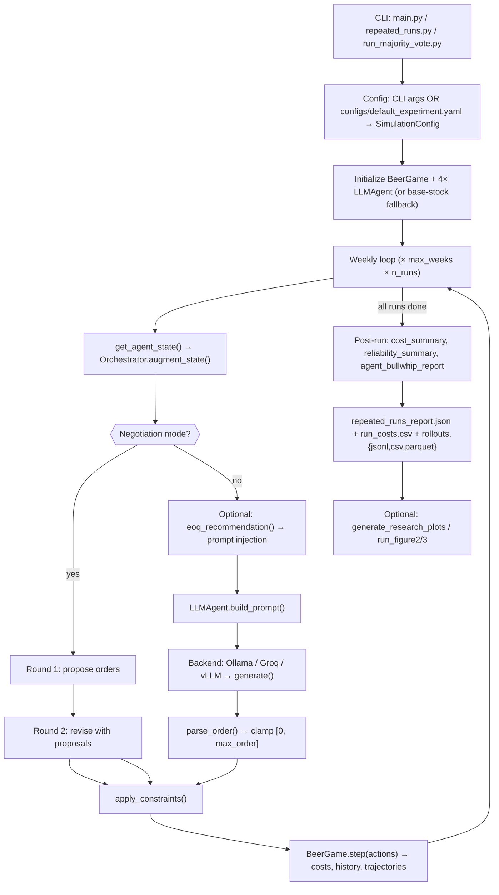
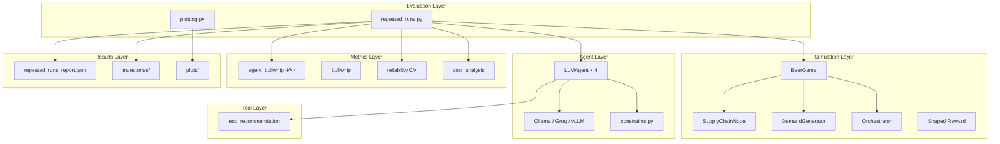
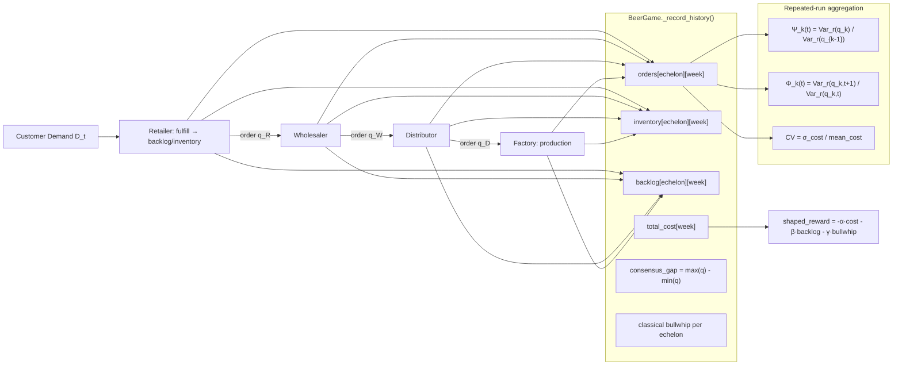

# Complete Technical & Research Audit — `ai_supplychain`

**Audit date:** June 6, 2026  
**Scope:** All 57 project Python files (~5,574 LOC), 18 markdown docs, 10 result folders, configs, plots  
**Roadmap reference:** `d:\Downloads\llm_supplychain_roadmap.md` — **not found on this machine.** Assessment below uses repository evidence only.

---

# PHASE 1 — REPOSITORY DISCOVERY

## 1. Repository Tree

```
ai_supplychain/
├── [CORE] main.py                          # CLI dispatcher (278 LOC)
├── [CORE] requirements.txt
├── [CORE] requirements_gpu.txt
├── [IMPORTANT] ARCHITECTURE.md
├── [IMPORTANT] README.md
├── [IMPORTANT] SETUP.md
├── [EXPERIMENTAL] package.json             # dotenv only — marginal value
├── [EXPERIMENTAL] package-lock.json
├── [UNUSED] venv/                          # committed/local venv — should not be in repo
├── [UNUSED] node_modules/                  # only for dotenv in llm_backends
│
├── agents/ [CORE]
│   ├── llm_agent.py [CORE]                 # 374 LOC — prompt, parse, majority vote
│   ├── llm_backends.py [CORE]              # 380 LOC — Ollama/Groq/vLLM
│   ├── constraints.py [CORE]             # 48 LOC
│   └── __init__.py [UNUSED]                # re-export never imported
│
├── simulator/ [CORE]
│   ├── beer_game.py [CORE]                 # 758 LOC — largest file, env loop
│   ├── config.py [CORE]
│   ├── demand.py [CORE]
│   ├── node.py [CORE]
│   ├── orchestrator.py [CORE]
│   ├── rewards.py [CORE]
│   ├── environment.py [UNUSED]             # alias only, 0 imports
│   └── __init__.py [UNKNOWN]
│
├── tools/ [CORE]
│   ├── inventory_tool.py [CORE]            # EOQ-like recommendation
│   └── __init__.py [UNUSED]
│
├── policies/ [IMPORTANT]
│   ├── base_stock.py [CORE]                # used as LLM fallback
│   ├── moving_average.py [IMPORTANT]       # baseline only
│   ├── random_policy.py [IMPORTANT]      # baseline only
│   └── classical_policies.py [UNUSED]    # duplicate of base_stock + moving_average
│
├── metrics/ [CORE]
│   ├── agent_bullwhip.py [CORE]            # Ψ, Φ, σ²
│   ├── bullwhip.py [CORE]
│   ├── reliability.py [CORE]
│   ├── cost_analysis.py [CORE]
│   ├── stability.py [IMPORTANT]
│   └── __init__.py [UNUSED]
│
├── evaluation/ [CORE]
│   ├── repeated_runs.py [CORE]             # 439 LOC — experiment hub
│   ├── plotting.py [CORE]                  # 366 LOC
│   ├── compare_models.py [IMPORTANT]
│   ├── benchmark.py [IMPORTANT]
│   ├── comparison_plots.py [IMPORTANT]
│   └── __init__.py [UNUSED]
│
├── experiments/ [IMPORTANT]
│   ├── llm_experiment.py [IMPORTANT]       # legacy single-run; backend CLI broken
│   ├── baseline_experiment.py [IMPORTANT]
│   ├── run_majority_vote.py [CORE]
│   ├── run_figure2.py [CORE]
│   ├── run_figure3.py [CORE]
│   ├── test_llm_agent.py [IMPORTANT]       # manual test script, not pytest
│   ├── test_state_api.py [IMPORTANT]
│   └── smoke_test.py [EXPERIMENTAL]        # not wired to main.py help
│
├── trajectories/ [CORE]
│   ├── schema.py
│   └── writer.py
│
├── configs/ [CORE]
│   ├── default_experiment.yaml
│   └── loader.py
│
├── analysis/ [EXPERIMENTAL]                # post-hoc plotting scripts, CLI-only
│   ├── plot_cost_distribution.py
│   ├── plot_consensus_gap_over_time.py
│   ├── plot_reliability_tradeoff.py
│   ├── generate_negotiation_failure_report.py
│   └── negotiation_failure_report.md
│
├── scripts/ [EXPERIMENTAL]
│   ├── groq_smoke_test.py
│   ├── groq_smoke_test_postproc.py
│   └── list_model.py
│
├── docs/ [IMPORTANT]
│   ├── REPLICATION_PLAN.md [STALE — partially]
│   ├── RESEARCH_NOTES.md [STALE — partially]
│   ├── METRICS.md [CORE]
│   ├── PAPER_FIGURE_MAPPING.md
│   ├── results_analysis.md
│   ├── agentic_lllm_consensus_seeking/ [IMPORTANT]
│   └── reliability_agent_bullwhip/ [IMPORTANT]
│
├── results/ [EXPERIMENTAL — artifacts]
│   ├── exp1_baseline/ … exp4_tool_negotiation/
│   ├── qwen25_30runs/, qwen3_32b_fig2/, figure3_n10/, figure3_n100/
│   ├── qwen3_32b_fig3_n10/ [partial]
│   └── sanity_after_fixes/
│
└── plots/ [EXPERIMENTAL — artifacts]
    ├── figure3_majority_vote_boxplots.png
    ├── llm_*.png (single-run plots)
    └── research/ (intervention plots)
```

## 2. Repository Purpose

| Dimension | Assessment |
|-----------|------------|
| **What it does** | Simulates a 4-echelon Beer Game where each tier is controlled by an LLM (or classical policy). Runs R repeated episodes on a fixed demand path to isolate decision stochasticity. Computes agent bullwhip (Ψ, Φ), reliability (CV), consensus gap, and exports trajectories. |
| **Problem solved** | Empirically tests whether autonomous LLM agents amplify order variance upstream (agent bullwhip) and whether coordination mechanisms (tools, negotiation, majority vote, orchestrator modes) mitigate it. |
| **Research contribution** | (1) Paper replication infrastructure for Long et al. agent-bullwhip framing; (2) **original extension**: tool-augmented vs negotiation vs combined interventions with reliability–cost tradeoff analysis on Qwen3-4B. |
| **Maturity** | **Research prototype, ~65% paper replication, ~40% publication-ready.** Core simulation and metrics are solid; empirical coverage is uneven; docs lag code; no formal test suite; several CLI wiring bugs. |

## 3. Execution Flow



**Canonical path:** `evaluation/repeated_runs.py` is the single source of truth for paper-aligned experiments. Everything else is legacy, convenience, or post-processing.

---

# PHASE 2 — ARCHITECTURE AUDIT

## System Architecture



## State Flow Diagram



## Agent Lifecycle (step-by-step)

1. **State** — `BeerGame.get_agent_state(name)` returns local inventory, backlog, pipeline, last_order, costs; `Orchestrator.augment_state()` adds shared fields per mode.
2. **Tool** (optional) — `eoq_recommendation(state)` → `tool_order` injected into state.
3. **Prompt** — `build_prompt()`: role context, numeric state, orchestrator block, tool block, negotiation proposals (round 2).
4. **LLM** — `query_model()` → backend `generate()` with temperature, num_predict (64 default / 512 reasoning).
5. **Parsing** — `parse_order()`: regex for labeled numbers, last integer, clamp negatives; `parse_order_optional` for majority vote samples.
6. **Constraints** — `apply_constraints()`: order_cap, budget_limit, safety_stock, panic limits, smoothing.
7. **Order** — integer passed to `BeerGame.step()`; metadata (tool_order, llm_order, difference) logged to trajectories.

**Negotiation adds:** Round 1 proposals stored → Round 2 state includes `negotiation_proposals` → revised order.

## Backend Architecture

| Backend | Transport | Default endpoint | Token budget | Response handling | Used in production runs |
|---------|-----------|------------------|--------------|-------------------|------------------------|
| **Ollama** | HTTP POST `/api/generate` | `localhost:11434` | min 64 (non-reasoning) | Raw `response` field | `qwen2.5:1.5b` Fig 2/3 |
| **Groq** | Groq SDK chat completions | Cloud API, `GROQ_API_KEY` | Similar reasoning split | Heavy post-processing: strip CoT, fences, ellipses | `qwen/qwen3-32b` fig2 |
| **vLLM** | OpenAI-compatible client | `localhost:8002/v1` | Chat completion | System prompt: "return only a number" | `Qwen/Qwen3-4B` exp1–4 |

**Key difference:** Ollama is single-shot generate; Groq/vLLM use chat with restrictive system prompts. Groq has the most defensive parsing. **Reasoning mode** is implemented in backends but **not exposed on `repeated_runs.py` CLI** (only programmatic API).

---

# PHASE 3 — CODEBASE HEALTH REVIEW

## Dead Code (with evidence)

| File / Symbol | Evidence |
|---------------|----------|
| `simulator/environment.py` | `BeerGameEnvironment = BeerGame` — grep shows 0 external imports |
| `policies/classical_policies.py` | Duplicates `base_stock.py` + `moving_average.py`; 0 imports |
| `agents/__init__.py`, `metrics/__init__.py`, `evaluation/__init__.py`, `tools/__init__.py` | Empty/minimal stubs; never `from X import` |
| `metrics/bullwhip.classical_bullwhip_adjacent`, `rolling_bullwhip` | Defined, never called |
| `metrics/agent_bullwhip.cumulative_psi` | Defined, never called |
| `experiments/smoke_test.py` | Not referenced by `main.py` or any import |
| `analysis/*.py` | CLI-only post-processors; 0 module imports |

## Duplicate Functionality

| Duplication | Locations | Impact |
|-------------|-----------|--------|
| Base-stock policy | `policies/base_stock.py` + `policies/classical_policies.py` + `tools/inventory_tool.eoq_recommendation` | Three near-identical replenishment formulas |
| Experiment runners | `llm_experiment.py` vs `repeated_runs.py` vs `compare_models.py` | Parallel loops with divergent feature support |
| Plotting | `evaluation/plotting.py` + `analysis/plot_*.py` + `evaluation/comparison_plots.py` | Overlapping boxplot/cost plots |
| Replication docs | `REPLICATION_PLAN.md` contains **two merged documents** (lines 1–178 + 179–343) with contradictory status |

## Technical Debt (ranked)

| Rank | Issue | Evidence |
|------|-------|----------|
| **Critical** | `llm_experiment.py` accepts `--backend` but **never passes it** to `LLMAgent` | Lines 217–232: `args.backend` unused |
| **Critical** | Negotiation mean cost (2,804) is **bimodal** (560–12,168); reporting mean alone is misleading | `negotiation_failure_report.md` |
| **Critical** | No automated test framework — only manual scripts | No pytest/unittest suite |
| **High** | `beer_game.py` at **758 LOC** — god object (sim + metrics + plotting + history) | Single file handles env, viz, compute_metrics |
| **High** | Dual state APIs (`get_state()` vs `get_agent_state()`) | `RESEARCH_NOTES.md` §1.3 |
| **High** | Stale documentation contradicts working code (majority vote "not implemented") | `RESEARCH_NOTES.md` L67, `REPLICATION_PLAN.md` L32 |
| **High** | `venv/` and `node_modules/` in workspace | 6,750+ tracked/glob files mostly deps |
| **Medium** | `compare_models.py` hardcoded to Ollama; no Groq/vLLM | No backend parameter |
| **Medium** | `reasoning_mode` not on CLI | Only `run_repeated_experiment()` kwarg |
| **Medium** | YAML `agents.retailer` per-echelon models **not wired** in `repeated_runs.py` | Config schema exists, single `model_name` used |
| **Low** | `ARCHITECTURE.md` has corrupted characters (`gents/`, `ewards.py`) | Copy/paste encoding issues |
| **Low** | Default model inconsistency: `qwen:1.5b` vs `qwen2.5:1.5b` | `main.py` L230 vs README |

## Refactoring Opportunities

1. **Split `beer_game.py`** → `environment.py` (step loop), `history.py` (recording), `visualization.py` (plots).
2. **Unify experiment entry** → single `experiments/run.py` with subcommands; deprecate `llm_experiment.py`.
3. **Delete** `classical_policies.py`, `environment.py` alias (or implement real Gymnasium wrapper).
4. **Wire YAML per-echelon models** in `repeated_runs.py` from `configs/loader.py`.
5. **Add `experiments/registry.yaml`** mapping experiment name → config → result path (replace ad-hoc folder names).
6. **Extract negotiation** from `repeated_runs.py` into `simulator/negotiation.py`.
7. **`.gitignore`** venv, node_modules, `__pycache__`, large parquet.

---

# PHASE 4 — RESEARCH AUDIT

## What Has Been Completed

| Idea | Status | Evidence | % |
|------|--------|----------|---|
| 4-echelon Beer Game simulator | ✅ Complete | `simulator/beer_game.py`, `node.py` | 100% |
| Fixed-demand repeated runs | ✅ Complete | `repeated_runs.py`, all result JSONs | 100% |
| Agent bullwhip Ψ, Φ, σ² | ✅ Complete | `metrics/agent_bullwhip.py`, all reports | 95% |
| Reliability CV, tail events | ✅ Complete | `metrics/reliability.py` | 90% |
| Orchestrator modes (5) | ✅ Implemented | `orchestrator.py`, negotiation in `repeated_runs.py` | 85% |
| Tool-augmented ordering | ✅ Run + analyzed | `exp2_tool`, `results_analysis.md` | 80% |
| Majority vote (Fig 3) | ✅ Implemented, partial runs | `generate_order_majority_vote`, `figure3_n10` | 70% |
| Figure 2 boxplots | ✅ Qualitative replication | `qwen25_30runs`, `run_figure2.py` | 75% |
| Multi-backend (Ollama/Groq/vLLM) | ✅ Implemented | `llm_backends.py`, results across backends | 80% |
| Trajectory export (GRPO-ready) | ✅ Complete | `trajectories/writer.py` | 85% |
| Negotiation coordination | ✅ Run + failure analysis | `exp3_negotiation`, failure report | 75% |
| Consensus metrics | ✅ Complete | `consensus_gap` in history + reports | 90% |
| Budget guardrails | ⚙️ Config only | `constraints.py` — **no published A/B results** | 40% |
| Human baseline comparison | ❌ Not started | Explicit gap in docs | 0% |
| GRPO post-training | ❌ Not started | Trajectory export only | 10% |
| Dynamic policy selection | ❌ Not started | — | 0% |
| Forecast-aware agents | ❌ Not started | Tool uses last demand only | 5% |
| Supply-chain digital twin | ❌ Not started | — | 0% |

## Partially Complete

| Component | Current State | Missing Work |
|-----------|---------------|--------------|
| Paper Figure 3 (N=100) | 5/10 runs, CV=0.046 preliminary | Complete to 30 runs; statistical tests |
| Orchestrator A/B (demand/history/centralized) | Code + YAML scenarios | No `results/` at R=30 for scenarios B–D |
| Budget constraint experiments | `ConstraintConfig` exists | No empirical runs in `results/` |
| Cross-model comparison | `compare_models.py` + qwen2.5 vs qwen3-32b | Not systematic; different backends confound |
| Classical baseline vs LLM | `baseline_experiment.py` exists | No paired repeated-run comparison in results |
| Instruction-following metrics | Mentioned in REPLICATION_PLAN | Not in `repeated_runs_report.json` |
| Publication figures | Some PNGs in `plots/` | No automated figure pipeline tied to paper numbering |

## Not Started

| Research Goal | Priority | Dependencies |
|---------------|----------|--------------|
| Human baseline ingestion (Fig 1) | P0 for paper claims | External Georgia Tech CSV |
| Statistical significance testing | P0 for publication | scipy/stats; complete N=100 runs |
| LLM vs base-stock at R=30 | P0 | Existing harness |
| Budget guardrail A/B at R=30 | P1 | Constraint calibration |
| GRPO training loop | P2 | GPU, grouped trajectories |
| Forecast-aware agents | P2 | Demand forecasting module |
| Dynamic policy selection | P2 | Policy registry + meta-agent |
| Heterogeneous per-echelon models | P2 | Wire YAML agents config |
| Multi-echelon digital twin | P3 | External data feeds |

## Research Novelty Assessment

| Comparison | Assessment |
|------------|------------|
| vs Beer Game literature | **Low novelty** — standard 4-tier, lead time 2, MIT demand |
| vs Bullwhip literature | **Moderate** — agent bullwhip (run-to-run Ψ) is paper-specific framing; implementation is faithful |
| vs Agentic supply chain literature | **Moderate–Strong** — tool + negotiation + consensus metrics on same LLM agents is less common |
| **Publication candidate** | **Yes, as extension paper** — "Reliability–coordination tradeoffs in tool-augmented multi-agent LLM supply chains" rather than pure replication |

**Strongest novel angle:** Demonstrating that negotiation collapses consensus gap and cost but creates **bimodal reliability** (CV=1.26), while tools improve CV without fixing coordination — a tradeoff the base paper does not explore.

---

# PHASE 5 — EXPERIMENT AUDIT

## Experiments Successfully Run

| Folder | Config | Model | Mode | Key Metrics | Outputs |
|--------|--------|-------|------|-------------|---------|
| `qwen25_30runs` | 20w, R=30, MIT demand | `qwen2.5:1.5b` Ollama | decentralized | cost=18,799, CV=0.089, Ψ W/D/F=3.6/1.5/2.3 | report, trajectories, CSV |
| `qwen3_32b_fig2` | 20w, R=10 | `qwen/qwen3-32b` Groq | decentralized | cost=4,973, CV=0.193 | complete |
| `figure3_n10` | 20w, R=10, N=10 vote | `qwen2.5:1.5b` | decentralized | cost=17,299, CV=0.108 | complete |
| `figure3_n100` | 20w, **5/10** runs, N=100 | `qwen2.5:1.5b` | decentralized | cost=17,744, CV=0.046 | **partial** |
| `exp1_baseline` | 20w, R=30 | `Qwen/Qwen3-4B` vLLM | decentralized, no tool | cost=16,492, CV=0.161, gap=18.1 | complete |
| `exp2_tool` | 20w, R=30 | Qwen3-4B | decentralized + tool | cost=15,282, CV=0.047, gap=29.0 | complete |
| `exp3_negotiation` | 20w, R=30 | Qwen3-4B | negotiation | cost=2,804, CV=1.258, gap=1.3 | complete (bimodal) |
| `exp4_tool_negotiation` | 20w, R=30 | Qwen3-4B | negotiation + tool | cost=12,852, CV=0.058, gap=17.8 | complete |
| `qwen3_32b_fig3_n10` | 25w, **5/30** | qwen3-32b | decentralized + vote | cost=15,735, CV=0.159, tail=0.60 | **interrupted** |
| `sanity_after_fixes` | 10w, R=2 | Qwen3-4B | decentralized | cost=3,429, CV=0.071 | debug only |

## Missing Experiments (critical for publication)

| Experiment | Why critical |
|------------|--------------|
| LLM vs base-stock at R=30, same demand | Establishes LLM harm/benefit vs sane baseline |
| Tool ON vs OFF on **same model** (qwen2.5) | Current tool results only on Qwen3-4B |
| Orchestrator modes A–D at R=30 | Paper Table 1 scenarios |
| Budget constraint ON vs OFF at R=30 | Paper Section 3.2 claim |
| Fig 3 N=100 complete (30 runs) | Statistical parity with N=1 baseline |
| Cross-model controlled (same backend) | Ollama qwen2.5 vs deepseek at R=30 |
| Think vs no_think factorial | Documented confound in archived JSON |
| Invalid-order / parse-failure rate | Reliability of autonomous AI |
| Long-horizon (30+ weeks) | Paper uses 30 weeks; many runs use 20 |

## Experiment Priority Ranking

| Priority | Experiments |
|----------|-------------|
| **P0** | Complete `figure3_n100`; LLM vs base-stock R=30; orchestrator modes R=30; fix reporting for bimodal negotiation (median + failure rate) |
| **P1** | Budget guardrail A/B; tool on qwen2.5; cross-model same-backend; statistical tests (bootstrap CI, Mann-Whitney) |
| **P2** | Think/no_think factorial; heterogeneous echelon models; GRPO pilot; human baseline when data available |

---

# PHASE 6 — PUBLICATION READINESS

| Venue | Readiness | What's Missing |
|-------|-----------|----------------|
| **Workshop paper** (agentic SCM, LLM reliability) | **55%** | Complete one clean A/B story; 2–3 figures; related work; fix stale methods description |
| **Conference paper** (AAMAS, IJCAI workshop, SCM OR) | **35%** | Statistical rigor; baseline comparisons; ablations; reproducibility package; novelty positioning |
| **Journal paper** | **20%** | Theory connection; human baselines; GRPO results; multi-scenario robustness; peer-level novelty |

## Strongest Publishable Story

**Hypothesis:** Multi-round LLM negotiation reduces supply-chain cost and order dispersion (consensus gap) but introduces **bimodal run outcomes** — excellent coordination in ~50% of runs, catastrophic backlog cascades in others — while deterministic tool recommendations improve coefficient of variation without restoring coordination.

**Experiments:** 4-condition factorial (baseline / tool / negotiation / tool+negotiation), Qwen3-4B, 30×20 fixed demand — **already run**.

**Metrics:** Mean cost, CV, consensus gap, Ψ/Φ, failure-mode analysis (backlog explosion, inventory collapse).

**Contribution:** First empirical characterization of the **reliability–coordination frontier** for tool-augmented vs negotiation-based LLM supply chain agents, with failure-mode taxonomy.

**Caveat:** Must report median/IQR and failure rate, not mean cost alone. Negotiation CV=1.26 invalidates "negotiation improves reliability" without qualification.

---

# PHASE 7 — FUTURE ROADMAP ALIGNMENT

| Vision Item | Current → Future |
|-------------|------------------|
| Forecast-aware agents | Last-demand EOQ tool → ARIMA/LLM forecast module in `tools/forecast_tool.py` |
| Dynamic policy selection | Fixed LLM per run → meta-orchestrator selects base-stock vs LLM vs tool per state |
| Orchestration layer | 5 modes in `Orchestrator` → pluggable protocol registry (broadcast, market, contract-net) |
| Consensus agents | 2-round negotiation → iterative consensus with convergence criteria |
| Tool-augmented reasoning | Single EOQ → suite (safety stock, newsvendor, simulation what-if) |
| Multi-agent coordination | Same model all echelons → heterogeneous roles + communication budget |
| Digital twin | Beer Game only → parameter calibration from real SKU data |

### 3-Month Plan
- Complete P0 experiments; fix docs and CLI bugs
- Publish workshop paper on negotiation reliability tradeoff
- Add pytest for Ψ/Φ on synthetic tensors
- Standardize experiment registry

### 6-Month Plan
- Orchestrator mode sweep at R=30
- GRPO pilot on exported trajectories
- Forecast-aware tool v1
- Human baseline integration if data obtained

### 12-Month Plan
- Dynamic policy selection layer
- Multi-echelon digital twin prototype
- Journal submission with GRPO + intervention results
- Open benchmark suite for LLM supply chain agents

---

# PHASE 8 — RECOMMENDED REPOSITORY RESTRUCTURE

```
ai_supplychain/
├── core/
│   ├── simulator/          # beer_game, node, demand, orchestrator, rewards, config
│   └── trajectories/       # schema, writer
├── agents/
│   ├── llm_agent.py
│   ├── llm_backends.py
│   └── constraints.py
├── policies/               # base_stock, moving_average, random
├── tools/
│   └── inventory_tool.py   # → later forecast_tool.py
├── metrics/                # all metric modules
├── evaluation/
│   ├── repeated_runs.py    # rename run_experiment.py
│   ├── benchmark.py
│   └── plotting/
├── experiments/
│   ├── registry.yaml       # NEW
│   └── runners/            # figure2, figure3, majority_vote
├── analysis/               # post-hoc scripts (keep)
├── configs/
├── research/
│   ├── notes/              # merge docs/RESEARCH_NOTES, results_analysis
│   └── papers/             # figure mapping, replication plan
├── results/                # gitignored large artifacts
├── docs/                   # user-facing README, SETUP, METRICS only
├── tests/                  # NEW — pytest
├── scripts/                # smoke tests
├── main.py
└── pyproject.toml          # replace requirements.txt
```

### File Actions

| Current | Action |
|---------|--------|
| `simulator/beer_game.py` | **KEEP** → split later |
| `simulator/environment.py` | **DELETE** or implement Gymnasium wrapper |
| `policies/classical_policies.py` | **DELETE** |
| `experiments/llm_experiment.py` | **MERGE** into `repeated_runs` or deprecate |
| `evaluation/compare_models.py` | **KEEP** — add backend param |
| `docs/REPLICATION_PLAN.md` | **MERGE** duplicate sections, update status |
| `docs/RESEARCH_NOTES.md` | **RENAME** → `research/notes/architecture_audit.md` |
| `venv/`, `node_modules/` | **DELETE** from repo, add `.gitignore` |
| `analysis/` | **KEEP** as `analysis/` |
| `docs/agentic_lllm_consensus_seeking/` | **RENAME** → `research/experiments/consensus_seeking/` |

---

# PHASE 9 — ACTIONABLE IMPLEMENTATION PLAN

| Task | Impact | Difficulty | Time | Deps | Rank |
|------|--------|------------|------|------|------|
| Fix `llm_experiment.py` backend wiring | High | Low | 1h | — | **Immediate** |
| Update stale docs (majority vote, Fig 3 status) | High | Low | 2h | — | **Immediate** |
| Add `.gitignore` for venv/node_modules/results | High | Low | 30m | — | **Immediate** |
| Report negotiation with median + failure rate | High | Medium | 4h | exp3 data | **Immediate** |
| Pytest for Ψ/Φ on synthetic orders | High | Medium | 1d | — | **Immediate** |
| Complete `figure3_n100` to 30 runs | High | Low (wall-clock) | 2–5d | Ollama GPU | **Next** |
| LLM vs base-stock R=30 paired comparison | High | Medium | 1d | — | **Next** |
| Orchestrator modes R=30 (scenarios C,D) | High | Medium | 2d | — | **Next** |
| Wire per-echelon YAML models | Medium | Medium | 1d | loader | **Next** |
| Expose `reasoning_mode` on CLI | Medium | Low | 2h | — | **Next** |
| Split `beer_game.py` | Medium | High | 3d | tests | **Later** |
| Budget guardrail A/B at R=30 | Medium | Medium | 1d | calibration | **Later** |
| GRPO trainer skeleton | High (research) | High | 2–3w | trajectories | **Later** |
| Human baseline loader | High (replication) | Medium | 1w | external CSV | **Later** |
| Forecast tool v1 | Medium | High | 2w | — | **Later** |

---

# PHASE 10 — FINAL DELIVERABLES

## 1. Executive Summary

This repository is a **functional research prototype** for LLM-driven Beer Game experiments with credible agent-bullwhip metrics and a working repeated-run pipeline. It has moved beyond "toy simulator" into **real empirical results** on two model families (qwen2.5 via Ollama, Qwen3-4B via vLLM, qwen3-32b via Groq).

**Brutal truth:**
- Paper replication is ~65% complete; infrastructure is ~90%.
- The most interesting original finding (negotiation bimodality vs tool reliability) is **publishable but under-reported**.
- Documentation is **actively misleading** in places (majority vote "missing", broken script references).
- Several files are dead weight (`classical_policies.py`, `environment.py`).
- `beer_game.py` is a maintainability risk at 758 LOC.
- No statistical testing, no human baseline, no formal tests.
- The referenced external roadmap file was not available for cross-check.

## 2. Repository Architecture Report

Five layers: Simulation → Agent (+Tool) → Metrics → Evaluation → Results. `evaluation/repeated_runs.py` is the hub. Orchestrator modes control information sharing; negotiation adds a 2-round protocol in the evaluation layer (not the simulator). Three LLM backends share `LLMAgent` interface with different transport and parsing strategies.

## 3. Code Health Report

**Grade: C+** — Works for research, not production. Critical CLI bug in `llm_experiment.py`. Dead code ~5% of policy/metrics surface. Largest coupling: negotiation logic inside `repeated_runs.py`, plotting inside `beer_game.py`. Dependencies (`venv`, `node_modules`) should not live in the tree.

## 4. Research Progress Report

| Long-term goal | Progress |
|----------------|----------|
| Bullwhip mitigation | Partial — tools help CV, negotiation helps cost, neither eliminates Ψ>1 |
| Reliability of autonomous AI | Strong — CV, tails, repeated runs implemented and run |
| Multi-agent consensus | Strong — negotiation + consensus gap metrics + failure analysis |
| Agentic supply chain control | Moderate — orchestrator modes coded, lightly tested |
| Dynamic policy selection | Not started |
| Forecast-aware agents | Not started (toy EOQ only) |
| Tool-augmented agents | Done + analyzed |
| Multi-echelon coordination | Done (negotiation) |
| Paper-quality experiments | Partial — uneven run counts, confounded backends |

## 5. Experiment Status Report

10 result folders; 8 complete, 2 partial/interrupted. Strongest data: `exp1–4` intervention study (30 runs each). Weakest: Fig 3 N=100 (5 runs), orchestrator sweeps (no results), budget constraints (no results).

## 6. Publication Readiness Report

Workshop-viable in **~6–8 weeks** if you: (1) fix negotiation reporting, (2) add base-stock baseline, (3) run 2 ablations, (4) write related work. Conference needs orchestrator sweep + stats. Journal needs GRPO + human data + theory.

## 7. Refactoring Plan

P0: delete dead files, fix CLI, add `.gitignore`, add tests. P1: split `beer_game.py`, unify experiment runner, experiment registry. P2: `pyproject.toml`, Gymnasium wrapper, async LLM calls.

## 8. Future Roadmap

3mo: workshop paper + P0 experiments. 6mo: GRPO pilot + orchestrator sweep + forecast tool. 12mo: digital twin + dynamic policy selection + journal submission.

## 9. Recommended Folder Structure

See Phase 8 above — `core/`, `agents/`, `evaluation/`, `research/`, `tests/` with gitignored `results/`.

## 10. Next 20 Concrete Tasks

1. Fix `llm_experiment.py` to pass `backend` to `LLMAgent`
2. Merge and update `REPLICATION_PLAN.md` (remove duplicate, mark Fig 3 done)
3. Update `RESEARCH_NOTES.md` L67 — majority vote **is** implemented
4. Add `.gitignore` (venv, node_modules, `__pycache__`, `*.parquet`)
5. Add `tests/test_agent_bullwhip.py` with synthetic order tensors
6. Add `tests/test_parse_order.py` for `LLMAgent.parse_order` edge cases
7. Complete `figure3_n100` to 30 runs
8. Run base-stock R=30 with identical demand → `results/baseline_base_stock_r30`
9. Run orchestrator `demand_sharing` R=30 → `results/orch_demand_sharing`
10. Run orchestrator `history_sharing` R=30
11. Run orchestrator `centralized` R=30
12. Run budget constraint ON/OFF paired comparison
13. Add median + IQR + failure_rate to `repeated_runs_report.json`
14. Expose `--reasoning-mode` on `repeated_runs.py` CLI
15. Wire per-echelon models from YAML in `repeated_runs.py`
16. Delete `policies/classical_policies.py`
17. Create `experiments/registry.yaml` documenting all result folders
18. Add `analysis/statistical_comparison.py` (bootstrap CI, Mann-Whitney)
19. Run tool ON/OFF on `qwen2.5:1.5b` (same backend as Fig 2)
20. Draft workshop paper outline around reliability–coordination tradeoff

---

**Insufficient evidence found for:** external roadmap (`llm_supplychain_roadmap.md`), human baseline data, GRPO training results, demand/history-sharing orchestrator empirical outcomes, instruction-following failure rates, and exact paper API model equivalence (GPT-5 mini, Llama 4 Maverick).