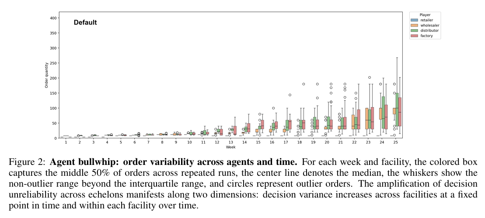
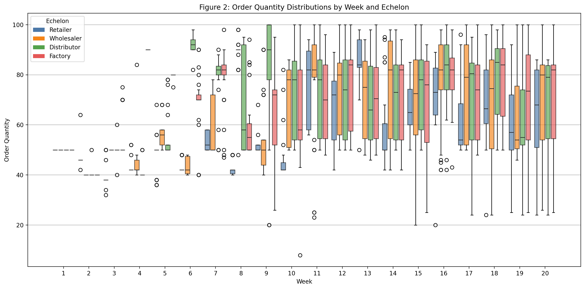

# Short Experimental Report – Figure 2 Agent Bullwhip Analysis

## Objective

To investigate whether autonomous LLM-based supply chain agents exhibit the Agent Bullwhip Effect by analyzing order variability across supply chain echelons and over time.

## Experimental Setup

- **Model:** qwen2.5:1.5b
- **Environment:** MIT Beer Game Simulator
- **Agents:** Retailer, Wholesaler, Distributor, Factory
- **Weeks:** 20
- **Runs:** 30
- **Demand Pattern:** Fixed step demand
- **Hardware:** CPU

The original paper used Qwen-3 4B and measured the Agent Bullwhip Effect through cross-echelon amplification (Ψ) and intertemporal accumulation (Φ).

## Original Paper Figure

_Figure 2 from the original paper showing Agent Bullwhip._

---

## Our Replication

_Figure 2 replication using qwen2.5:1.5b._

---

## Observation

Both figures show widening order distributions over time and stronger variability in upstream agents (Wholesaler, Distributor, Factory). This qualitative agreement supports successful reproduction of the Agent Bullwhip Effect.

## Results

| Metric    |     Value |
| --------- | --------: |
| Mean Cost | 18,799.03 |
| CV        |     8.86% |
| Mean Ψ    |      2.44 |
| Mean Φ    |      4.44 |

### Cross-Echelon Amplification (Ψ)

| Echelon     | Mean Ψ |
| ----------- | -----: |
| Wholesaler  |   3.58 |
| Distributor |   1.46 |
| Factory     |   2.27 |

### Intertemporal Accumulation (Φ)

| Echelon     | Mean Φ |
| ----------- | -----: |
| Retailer    |   1.87 |
| Wholesaler  |   1.84 |
| Distributor |   2.76 |
| Factory     |  11.29 |

## Observations

- Retailer orders remained relatively stable.
- Variability increased significantly in upstream echelons.
- Order distributions widened over time, indicating growing variance.
- All upstream echelons satisfied **Ψ > 1**.
- All echelons satisfied **Φ > 1**.
- The Factory exhibited the strongest amplification effects.

## Conclusion

The experiment successfully reproduced the qualitative behavior reported in Figure 2 of the paper. Results show both cross-echelon amplification and intertemporal accumulation of decision variance, supporting the existence of the Agent Bullwhip Effect in autonomous LLM-driven supply chains.
