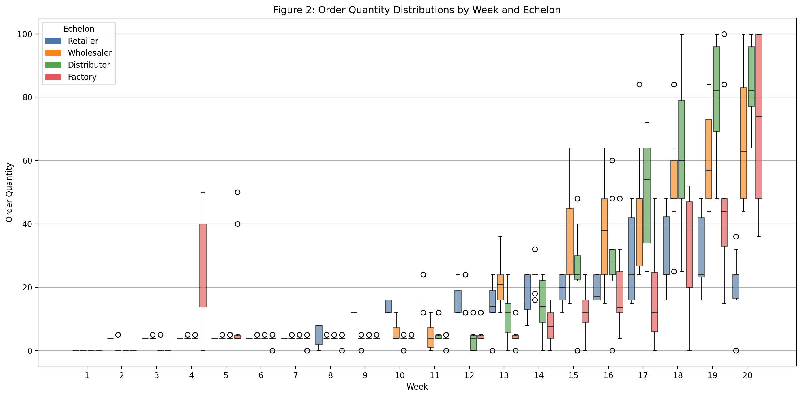

# Short Experimental Report – Figure 2 Agent Bullwhip Analysis

## Objective

To investigate whether autonomous LLM-based supply chain agents exhibit the Agent Bullwhip Effect by analyzing order variability across supply chain echelons and over time.

## Experimental Setup

### Replication 1

- **Model:** qwen2.5:1.5b
- **Environment:** MIT Beer Game Simulator
- **Agents:** Retailer, Wholesaler, Distributor, Factory
- **Weeks:** 20
- **Runs:** 30
- **Demand Pattern:** Fixed step demand
- **Hardware:** CPU

### Replication 2

- **Model:** qwen/qwen3-32b
- **Environment:** MIT Beer Game Simulator
- **Agents:** Retailer, Wholesaler, Distributor, Factory
- **Weeks:** 20
- **Runs:** 10
- **Demand Pattern:** Fixed step demand
- **Backend:** Groq API

The original paper used Qwen-3 4B and measured the Agent Bullwhip Effect through cross-echelon amplification (Ψ) and intertemporal accumulation (Φ).

---

## Original Paper Figure

_Figure 2 from the original paper showing Agent Bullwhip._

---

## Our Replication

### Qwen2.5-1.5B

_Figure 2 replication using qwen2.5:1.5b._

### Qwen3-32B

_Figure 2 replication using qwen/qwen3-32b._

---

## Qualitative Observation

Both replications exhibit the same qualitative behavior reported in the paper:

- Order variability increases as decisions move upstream through the supply chain.
- Variance accumulates over time.
- Factory and Distributor stages exhibit substantially larger fluctuations than Retailer.
- Autonomous LLM agents amplify demand uncertainty despite receiving the same customer demand signal.

These observations are consistent with the Agent Bullwhip Effect described in the original work.

---

# Results

## Qwen2.5-1.5B

| Metric    |     Value |
| --------- | --------: |
| Mean Cost | 18,799.03 |
| CV        |     8.86% |
| Mean Ψ    |      2.44 |
| Mean Φ    |      4.44 |

### Cross-Echelon Amplification (Ψ)

| Echelon     | Mean Ψ |
| ----------- | -----: |
| Wholesaler  |   3.58 |
| Distributor |   1.46 |
| Factory     |   2.27 |

### Intertemporal Accumulation (Φ)

| Echelon     | Mean Φ |
| ----------- | -----: |
| Retailer    |   1.87 |
| Wholesaler  |   1.84 |
| Distributor |   2.76 |
| Factory     |  11.29 |

---

## Qwen3-32B

| Metric    |    Value |
| --------- | -------: |
| Mean Cost | 4,972.80 |
| CV        |   19.28% |
| Mean Ψ\*  |   129.82 |
| Mean Φ    |     2.89 |

### Cross-Echelon Amplification (Ψ)

| Echelon     | Mean Ψ |
| ----------- | -----: |
| Wholesaler  |   3.44 |
| Distributor |   2.26 |
| Factory     | 383.75 |

### Intertemporal Accumulation (Φ)

| Echelon     | Mean Φ |
| ----------- | -----: |
| Retailer    |   2.24 |
| Wholesaler  |   3.43 |
| Distributor |   3.21 |
| Factory     |   2.68 |

- The extremely large Factory Ψ value is influenced by near-zero downstream variance during some early periods, causing ratio inflation. It should be interpreted cautiously.

---

# Cross-Model Comparison

| Metric    | Qwen2.5-1.5B | Qwen3-32B |
| --------- | -----------: | --------: |
| Mean Cost |    18,799.03 |  4,972.80 |
| CV        |        8.86% |    19.28% |
| Mean Ψ    |         2.44 |  129.82\* |
| Mean Φ    |         4.44 |      2.89 |

### Key Findings

#### Cost Performance

Qwen3-32B achieved substantially lower average supply chain cost than Qwen2.5-1.5B.

#### Reliability

Qwen2.5 exhibited lower run-to-run variability (CV), while Qwen3 displayed greater instability across repeated simulations.

#### Agent Bullwhip

Both models exhibited:

- Ψ > 1 across upstream echelons.
- Φ > 1 across echelons.
- Growing variance over time.
- Amplification of decision variability moving upstream.

These results support the existence of the Agent Bullwhip Effect across multiple LLM architectures.

---

# Observations

- Retailer orders remained relatively stable in both experiments.
- Variability increased significantly in upstream echelons.
- Order distributions widened over time.
- Cross-echelon amplification (Ψ > 1) was consistently observed.
- Intertemporal accumulation (Φ > 1) was consistently observed.
- Factory and Distributor stages showed the strongest instability.
- Larger models did not eliminate the Agent Bullwhip Effect.

---

# Conclusion

The experiments successfully reproduced the qualitative behavior reported in Figure 2 of the paper. Both Qwen2.5-1.5B and Qwen3-32B exhibited increasing order variance across supply chain stages and over time, demonstrating the presence of the Agent Bullwhip Effect in autonomous LLM-driven supply chains.

The findings suggest that scaling model size alone does not eliminate supply chain instability. Despite differences in cost and variability characteristics, both models produced amplified ordering behavior consistent with the original paper's conclusions.
