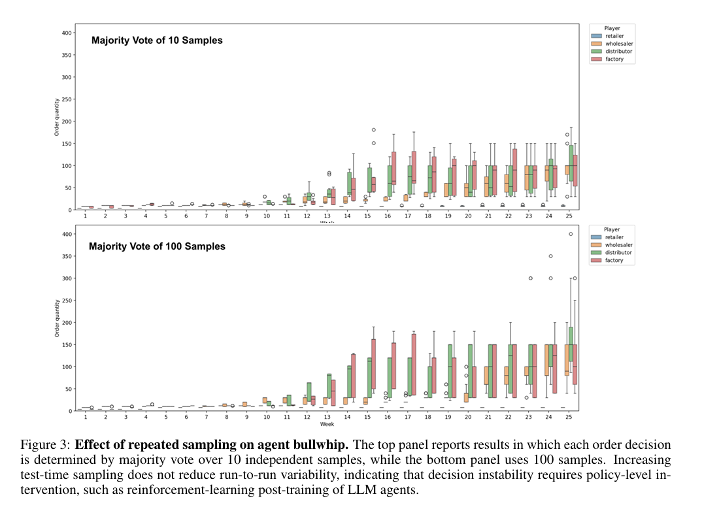
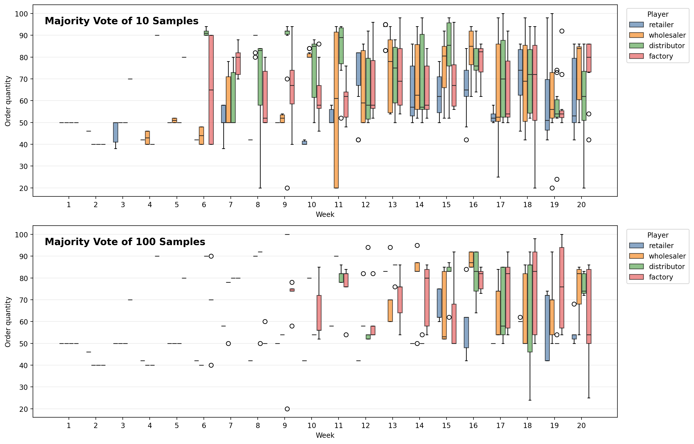

# Short Experimental Report – Figure 3 Effect of Repeated Sampling on Agent Bullwhip

## Objective

To investigate whether repeated test-time sampling (majority voting) reduces decision instability and mitigates the Agent Bullwhip Effect in autonomous LLM-driven supply chains.

## Experimental Setup

- **Model:** qwen2.5:1.5b
- **Environment:** MIT Beer Game Simulator
- **Agents:** Retailer, Wholesaler, Distributor, Factory
- **Weeks:** 20
- **Demand Pattern:** Fixed step demand
- **Voting Strategies:**
  - N = 10 samples
  - N = 100 samples

- **Hardware:** NVIDIA A40 GPU

The original paper evaluates whether increasing the number of independent LLM samples during decision making improves reliability and reduces Agent Bullwhip.

## Original Paper Figure

_Figure 3 from the original paper showing the effect of majority voting with 10 and 100 samples._

---

## Our Replication

_Figure 3 replication using qwen2.5:1.5b._

---

## Results

| Experiment | Runs | Mean Cost |     CV |
| ---------- | ---: | --------: | -----: |
| N = 1      |   30 | 18,799.03 |  8.86% |
| N = 10     |   10 | 17,298.80 | 10.80% |
| N = 100\*  |    5 | 17,744.00 |  4.61% |

- The N=100 experiment was interrupted after five completed runs. Results should therefore be interpreted as preliminary.

### Agent Bullwhip Metrics (Exploratory)

#### Cross-Echelon Amplification (Ψ)

| Experiment | Wholesaler | Distributor | Factory |
| ---------- | ---------: | ----------: | ------: |
| N = 10     |      13.28 |       18.34 |   19.84 |
| N = 100\*  |      89.18 |        1.93 |   21.59 |

#### Intertemporal Accumulation (Φ)

| Experiment | Retailer | Wholesaler | Distributor | Factory |
| ---------- | -------: | ---------: | ----------: | ------: |
| N = 10     |     5.81 |      27.98 |        8.89 |    1.50 |
| N = 100\*  |    89.58 |       2.43 |        7.42 |    2.07 |

**Note:** Mean Ψ and Φ values are highly sensitive to extreme ratios and should be interpreted cautiously. Figure 3 is primarily evaluated qualitatively through boxplot distributions rather than aggregate means.

---

## Observations

- Majority voting reduced average supply-chain cost compared to the baseline.
- Increasing the sample count to N=100 substantially reduced run-to-run variability.
- Variability remained visible across weeks even with N=100.
- Upstream agents (Distributor and Factory) continued to exhibit wider order distributions than downstream agents.
- The demand shock continued to propagate through the supply chain under both voting strategies.
- Order distributions did not collapse to a single stable policy, indicating persistent decision instability.

## Comparison with the Paper

The original paper concludes that repeated sampling alone does not eliminate Agent Bullwhip and that substantial decision instability remains even when large voting pools are used.

Our replication shows similar qualitative behavior:

- Order distributions remain spread across runs.
- Variability persists in later weeks.
- Upstream amplification remains visible.
- Increasing the number of samples improves reliability but does not completely remove instability.

These observations are consistent with the central conclusion reported in the paper.

## Discussion

Although majority voting improved reliability, Agent Bullwhip remained observable under both N=10 and N=100 settings. The persistence of wide order distributions suggests that test-time sampling alone is insufficient to fully stabilize autonomous supply-chain decision making.

This aligns with the paper's motivation for reinforcement-learning post-training methods explored in later sections.

## Conclusion

The experiment successfully reproduced the qualitative behavior reported in Figure 3 of the paper. Majority voting improved reliability and reduced variability, particularly at N=100, but Agent Bullwhip remained present across supply-chain echelons. These findings support the paper's claim that policy-level interventions are required to substantially reduce decision instability in autonomous LLM-driven supply chains.
