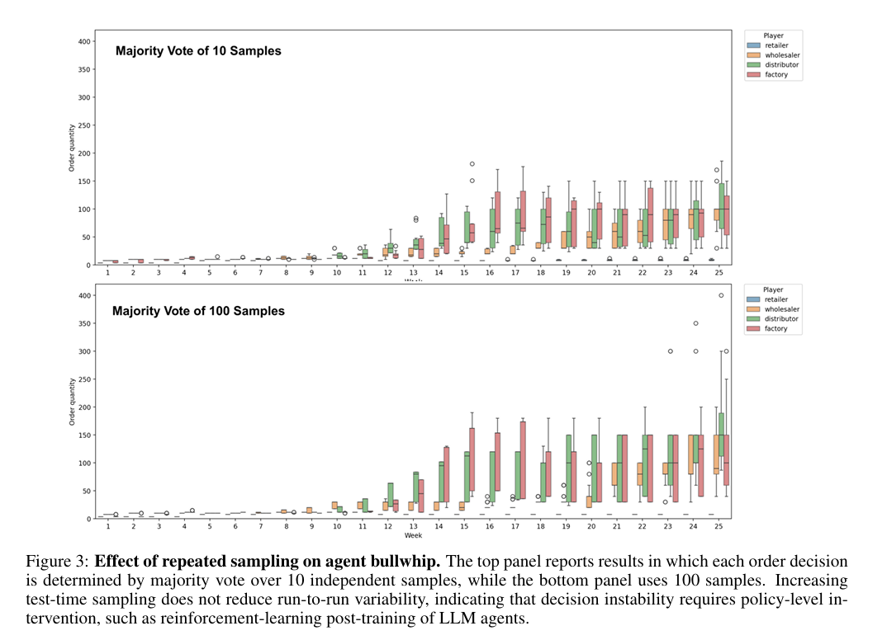
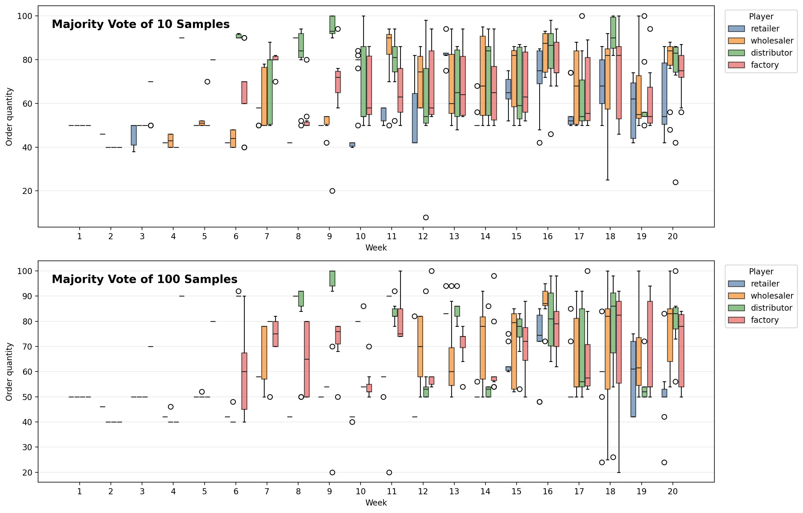

# Short Experimental Report – Figure 3: Effect of Repeated Sampling on Agent Bullwhip

## Objective

To investigate whether repeated test-time sampling (majority voting) reduces decision instability and mitigates the Agent Bullwhip Effect in autonomous LLM-driven supply chains.

---

## Experimental Setup

* **Model:** qwen2.5:1.5b
* **Environment:** MIT Beer Game Simulator
* **Agents:** Retailer, Wholesaler, Distributor, Factory
* **Weeks:** 20
* **Demand Pattern:** Fixed step demand
* **Voting Strategies:**

  * N = 10 samples
  * N = 100 samples
* **Hardware:** NVIDIA A40 GPU

The original paper evaluates whether increasing the number of independent LLM samples during decision making improves reliability and reduces Agent Bullwhip.

---

## Original Paper Figure

*Figure 3 from the original paper showing the effect of majority voting with 10 and 100 samples.*

---

## Our Replication

*Figure 3 replication using qwen2.5:1.5b.*

---

## Results

| Experiment | Runs | Mean Cost |
| ---------- | ---: | --------: |
| N = 1      |   30 | 18,799.03 |
| N = 10     |   10 | 17,704.90 |
| N = 100    |   10 | 17,581.40 |

### Cost Improvement

| Comparison   | Improvement |
| ------------ | ----------: |
| N=1 → N=10   |       5.82% |
| N=10 → N=100 |       0.70% |
| N=1 → N=100  |       6.48% |

Increasing the voting pool from 10 to 100 samples required approximately an order of magnitude more inference calls while producing only a modest reduction in average supply-chain cost.

---

## Observations

* Majority voting reduced average supply-chain cost compared to the single-sample baseline.
* Increasing the voting pool from 10 to 100 samples produced only a small additional improvement in average cost.
* Substantial variability remained visible across weeks under both voting strategies.
* Upstream agents (Distributor and Factory) continued to exhibit wider order distributions than downstream agents.
* The demand shock propagated through the supply chain under both N=10 and N=100 settings.
* Order distributions did not collapse to a single stable policy even with 100-sample majority voting.
* Increasing the number of samples altered the distribution of decisions but did not eliminate decision instability.

---

## Comparison with the Paper

The original paper concludes that repeated sampling alone does not eliminate Agent Bullwhip and that substantial decision instability remains even when large voting pools are used.

Our replication demonstrates similar qualitative behavior:

* Order distributions remain spread across runs.
* Variability persists in later weeks.
* Upstream amplification remains visible.
* Increasing the number of samples provides only limited stabilization benefits.
* Significant decision variability remains even under 100-sample majority voting.

These observations are consistent with the central conclusion reported in the original paper.

---

## Discussion

Majority voting reduced average supply-chain cost relative to the single-sample baseline. However, increasing the voting pool from 10 to 100 samples produced only marginal additional gains while requiring substantially more computation.

The persistence of wide order distributions suggests that test-time sampling alone is insufficient to fully stabilize autonomous supply-chain decision making. Although larger voting pools can smooth some decision variability, Agent Bullwhip remains observable throughout the supply chain.

These findings align with the paper's motivation for policy-level interventions, such as reinforcement-learning post-training, to achieve stronger behavioral stabilization.

---

## Conclusion

The experiment successfully reproduced the qualitative behavior reported in Figure 3 of the original paper.

Increasing the number of majority-vote samples from 10 to 100 produced only a small improvement in average supply-chain cost (17,704.9 → 17,581.4) while significant order variability remained across runs. The results support the paper's conclusion that repeated sampling alone is insufficient to eliminate Agent Bullwhip and that policy-level interventions are likely required to substantially reduce decision instability in autonomous LLM-driven supply chains.
