# Updated Research & Implementation Plan

**Created:** June 6, 2026  
**Sources:** `New_plan.md` (repository audit, June 2026) + `llm_supplychain_roadmap.md` (ultimate research vision)  
**Purpose:** Single actionable plan from **current state** → **ultimate goal**

---

## Executive Summary

The repository today is a **working Beer Game LLM experiment platform** (~65% paper replication, ~5,574 LOC) where each echelon is an LLM that outputs an **order quantity** directly. The ultimate research vision is fundamentally different and more ambitious:

> **Run echelon-specific time series forecasts → feed structured signals to an LLM orchestrator → orchestrator selects ordering policies (OUT, POUT, EOQ, etc.) per echelon per period → classical solvers compute parameters → simulator advances state in a closed loop.**

That pivot is a **genuine research gap** (not covered by InvAgent, AIM-Bench, or Jannelli et al. alone). The existing codebase is not wasted — it becomes the **simulation + evaluation + metrics foundation** under the new orchestration layer.

**Strategic sequence:**
1. **Stabilize** what exists (audit P0 fixes, close replication gaps).
2. **Extend** toward forecast-aware, policy-selecting agents (incremental, inside current architecture).
3. **Transform** to LangGraph-orchestrated multi-agent system with per-echelon forecasting (roadmap target).

---

## Part A — Ultimate Research Goal (from Roadmap)

### Core Hypothesis

Giving an LLM **interpreted forecast signals** (not raw demand numbers) and authority to **select policy structure** (not just order size) reduces bullwhip and improves cost–reliability tradeoffs compared to:
- fixed classical policies,
- raw-number LLM ordering (current repo paradigm),
- single-policy LLM ordering with tool hints only.

### Target System (Period Loop)

```
Period t:
  ├─ Echelon 1 Agent → ARIMA/ETS forecast summary (retailer demand)
  ├─ Echelon 2 Agent → LSTM forecast summary (warehouse orders)
  ├─ Echelon 3 Agent → TFT forecast summary (distributor orders)
  ├─ Echelon 4 Agent → TFT/ARMA forecast summary (factory orders)
  ├─ Lead-time forecaster → stochastic LT signal per echelon
  │
  └─ LLM Orchestrator (chain-of-thought + RAG + tools)
       ├─ Assess bullwhip risk per echelon
       ├─ Identify cause (autocorrelation, LT variance, batching)
       ├─ Select policy: LOT_FOR_LOT | OUT | POUT | EOQ | MIN_MAX | FULL_STATE_OUT
       ├─ Call math tools for α, β, safety stock, bullwhip ratio
       └─ Emit structured JSON → Order Execution → Inventory Update → Evaluation
```

### Novelty Claim (Publication Framing)

| Layer | Current literature | This project (target) |
|-------|-------------------|----------------------|
| LLM role | Ordering agent (quantity) | **Policy orchestrator** (structure + parameters) |
| Input | Raw state / demand | **Forecast summaries** + inventory + pipeline + LT variance |
| Echelon models | Same model everywhere | **Different TS models per echelon** |
| Policy set | Implicit in prompt | **Explicit registry** with RAG-grounded selection |
| Evaluation | Cost, classical bullwhip | Cost + **agent bullwhip Ψ/Φ** + policy-switch stability |

### Required Capabilities Not Yet Built

| Gap (Roadmap) | Current Repo Status |
|---------------|---------------------|
| Per-echelon time series forecasting | ❌ Not started (`eoq_recommendation` uses last demand only) |
| Structured forecast JSON for LLM | ❌ Not started |
| Dynamic policy selection | ❌ Not started (fixed LLM → integer order) |
| Policy registry (OUT, POUT, EOQ, …) | ⚙️ Partial (`base_stock`, `moving_average` only) |
| LLM as meta-orchestrator | ⚙️ Partial (`Orchestrator` shares info; does not select policies) |
| Lead time forecasting | ❌ Fixed lead time = 2 in simulator |
| RAG for policy knowledge | ❌ Not started |
| Math solver tools (POUT α, bullwhip) | ⚙️ Partial (single EOQ-like tool) |
| LangGraph state machine | ❌ Not started (`repeated_runs.py` linear loop) |
| Feedback loop (prior period outcomes → orchestrator) | ⚙️ Partial (history in state, not policy outcomes) |
| Guardrails | ✅ `constraints.py` exists |

---

## Part B — Current Baseline (from Audit)

### What Works Today (Keep & Build On)

| Asset | Location | Reuse for Ultimate Goal |
|-------|----------|-------------------------|
| 4-echelon Beer Game | `simulator/beer_game.py` | **Simulation environment** (Part 7 of roadmap) |
| Orchestrator info-sharing modes | `simulator/orchestrator.py` | Input to orchestrator context |
| LLM backends (Ollama/Groq/vLLM) | `agents/llm_backends.py` | Orchestrator + echelon agents |
| Agent bullwhip Ψ, Φ, σ² | `metrics/agent_bullwhip.py` | **Primary evaluation** for policy-selection experiments |
| Reliability CV, tails | `metrics/reliability.py` | Compare policy-switch vs fixed-policy reliability |
| Repeated-run engine | `evaluation/repeated_runs.py` | Experiment harness (extend, don't replace yet) |
| Trajectory export | `trajectories/` | GRPO + policy decision logging |
| Tool injection pattern | `tools/inventory_tool.py` | Template for forecast + solver tools |
| Negotiation protocol | `repeated_runs.py` | Precursor to multi-agent coordination |
| Empirical results (exp1–4) | `results/exp*` | Near-term workshop paper (interim story) |

### What Must Be Fixed First (Audit P0 — Weeks 1–2)

| # | Task | Why |
|---|------|-----|
| 1 | Fix `llm_experiment.py` backend wiring | CLI correctness |
| 2 | Update stale docs (Fig 3, majority vote) | Research integrity |
| 3 | Add `.gitignore` (venv, node_modules) | Repo hygiene |
| 4 | Negotiation reporting: median + IQR + failure rate | Bimodal results (CV=1.26) |
| 5 | `tests/test_agent_bullwhip.py` | Metrics correctness before new experiments |
| 6 | Delete `policies/classical_policies.py`, unused `environment.py` alias | Dead code |

### Interim Publishable Story (Before Orchestrator Pivot)

**While building toward the roadmap**, the existing **reliability–coordination tradeoff** story remains valid:

- Negotiation: lowest cost + consensus gap, **bimodal** reliability
- Tool: lowest CV, **worse** consensus gap
- Data: `exp1–4`, Qwen3-4B, 30×20 runs — **already complete**

Target: workshop paper in 6–8 weeks on this story; position orchestrator work as Phase 2 contribution.

---

## Part C — Gap Map: Current → Ultimate

```mermaid
flowchart LR
    subgraph Now["Current (Phase 0)"]
        A1["LLM → order integer"]
        A2["Single EOQ tool hint"]
        A3["Orchestrator = info sharing"]
        A4["Fixed lead time"]
    end

    subgraph Mid["Phase 1–2 (3–6 mo)"]
        B1["Forecast summaries per echelon"]
        B2["LLM chooses policy name"]
        B3["Solver tools compute params"]
        B4["Policy executor in simulator"]
    end

    subgraph Ultimate["Phase 3–4 (6–12 mo)"]
        C1["Per-echelon TS models"]
        C2["LangGraph orchestration"]
        C3["RAG policy knowledge"]
        C4["Stochastic lead times"]
        C5["Digital twin calibration"]
    end

    Now --> Mid --> Ultimate
```



---

## Part D — Phased Implementation Plan

### Phase 0: Stabilize Foundation (Weeks 1–4)

**Goal:** Trustworthy baseline + close replication gaps before architectural pivot.

| Task | Output | Est. |
|------|--------|------|
| Audit P0 fixes (above) | Clean repo | 1 week |
| Complete `figure3_n100` to 30 runs | Fig 3 complete | 2–5 days GPU |
| LLM vs base-stock R=30 | `results/baseline_base_stock_r30` | 1 day |
| Orchestrator modes R=30 (demand/history/centralized) | Table 1 scenarios | 2 days |
| `experiments/registry.yaml` | Reproducible experiment index | 4h |
| Workshop paper draft (exp1–4 story) | `docs/papers/workshop_draft.md` | 2 weeks |

**Exit criteria:** pytest green; 3+ orchestrator result folders; replication docs accurate.

---

### Phase 1: Forecast-Aware Layer (Weeks 5–10)

**Goal:** Introduce per-echelon forecasting **without** LangGraph yet — minimal invasion of current loop.

#### New Modules

```
forecasting/
├── __init__.py
├── base.py              # ForecastSummary dataclass
├── arima_forecaster.py  # Echelon 1 (Retailer)
├── ets_forecaster.py    # Echelon 1–2 fallback
├── lstm_forecaster.py   # Echelon 2–3 (optional GPU)
├── schemas.py           # JSON summary for LLM (roadmap Part 2.3)
└── registry.py          # echelon → model mapping

tools/
├── inventory_tool.py    # KEEP
├── forecast_tool.py     # NEW — wraps forecasting/
├── pout_solver.py       # NEW — compute α, β (Disney & Lambrecht)
└── bullwhip_tool.py     # NEW — Var(orders)/Var(demand)
```

#### Forecast Summary Schema (from Roadmap)

```json
{
  "echelon": "Wholesaler",
  "forecast_model": "LSTM",
  "demand_next_period": 340,
  "demand_uncertainty": "high",
  "trend": "slightly_upward",
  "seasonality_detected": false,
  "lead_time_forecast": 4.2,
  "lead_time_variance": "high",
  "autocorrelation": 0.72,
  "recommended_safety_stock_buffer": "increase"
}
```

#### Integration Point

Extend `LLMAgent.build_prompt()` OR add `ForecastAwareAgent` wrapper:

1. `forecast_tool.get_summary(echelon, history)` → append to prompt
2. LLM still outputs order **for now** (backward compatible)
3. Log forecast summary in trajectories

#### Experiments

| Experiment | Hypothesis |
|------------|------------|
| Raw state vs forecast summary (same model) | Structured forecasts reduce anchoring bias |
| ARIMA@Retailer + naive@Factory vs all-ARIMA | Echelon-specific models matter upstream |

**Exit criteria:** `forecast_tool.py` wired; 2 ablation result folders; forecast fields in `rollouts.jsonl`.

---

### Phase 2: Dynamic Policy Selection (Weeks 11–18)

**Goal:** LLM selects **policy + parameters**, not raw order quantity.

#### New Modules

```
policies/
├── base_stock.py        # OUT — KEEP
├── moving_average.py    # KEEP
├── pout.py              # NEW — Proportional OUT
├── lot_for_lot.py       # NEW
├── eoq.py               # NEW — (s, Q)
├── min_max.py           # NEW — (s, S)
├── full_state_out.py    # NEW — ARMA-parameterized (stretch)
└── registry.py          # NEW — name → callable + param schema

agents/
├── policy_orchestrator.py   # NEW — LLM selects from registry
├── llm_agent.py             # KEEP for legacy mode
└── policy_executor.py       # NEW — applies selected policy to state
```

#### Orchestrator Prompt (Roadmap Part 4.3)

```
Step 1: Assess bullwhip risk per echelon (low/medium/high)
Step 2: Identify primary cause
Step 3: Select policy from [LOT_FOR_LOT, OUT, POUT, EOQ, MIN_MAX]
Step 4: Call tools for parameters (compute_pout_parameters, etc.)
Step 5: Output JSON
```

#### Simulator Change

Add `BeerGame.step_policy(policy_decisions)` where each echelon runs:

```python
policy_fn = registry.get(decision["policy"])
order = policy_fn(state, **decision["parameters"])
```

Keep `step(actions)` for legacy LLM-direct mode via config flag:

```yaml
agent_mode: direct_order | policy_selection
```

#### Experiments (Core Contribution)

| Condition | Description |
|-----------|-------------|
| A | Fixed OUT (classical baseline) |
| B | Fixed POUT (α=0.4) |
| C | LLM direct order (current paradigm) |
| D | LLM policy selection + forecast summaries |
| E | D + RAG (Phase 3) |

**Metrics:** mean cost, CV, Ψ/Φ, policy-switch rate, bullwhip ratio, service level.

**Exit criteria:** Policy registry with ≥4 policies; one full R=30 comparison A vs C vs D.

---

### Phase 3: LangGraph Orchestration + RAG (Weeks 19–30)

**Goal:** Replace linear `repeated_runs` negotiation block with graph-based multi-agent loop.

#### New Stack Dependencies

```
requirements_forecast.txt   # statsmodels, pytorch-forecasting (optional)
requirements_agents.txt     # langgraph, langchain, chromadb
```

#### Graph Structure (Roadmap Part 5.1)

```
StateGraph(SupplyChainState)
  nodes:
    - echelon_1_forecast … echelon_4_forecast
    - lead_time_forecast
    - llm_orchestrator (RAG + tools)
    - policy_executor
    - inventory_update
    - evaluate_metrics
  edges:
    forecasts → orchestrator → execute → update → (loop or end)
```

#### RAG Knowledge Base (`research/rag/`)

- Policy descriptions (OUT, POUT, EOQ) with bullwhip conditions
- Excerpts: Dejonckheere et al. (2003), Disney & Lambrecht (2008)
- Rules: autocorrelation level → recommended policy
- **Your own experiment outcomes** (retrieved by scenario similarity)

#### Migration Strategy

- `evaluation/repeated_runs.py` → thin CLI wrapper
- `evaluation/langgraph_runner.py` → new engine
- Shared: `BeerGame`, `metrics/`, `trajectories/`

**Exit criteria:** LangGraph run produces same JSON report format; RAG ablation (E vs D) complete.

---

### Phase 4: Advanced Research (Months 8–12)

| Track | Deliverable |
|-------|-------------|
| Stochastic lead times | `simulator/demand.py` + LT forecaster; Michna et al. experiments |
| Per-echelon heterogeneous LLMs | Wire YAML `agents.retailer` etc. |
| GRPO on policy decisions | `train/grpo_trainer.py` using trajectory groups |
| Digital twin pilot | Calibrate demand/LT from external CSV |
| Open benchmark | `benchmarks/policy_orchestrator_v1/` |

---

## Part E — Target Architecture

```
┌─────────────────────────────────────────────────────────────┐
│              SIMULATION (existing BeerGame)                  │
│   stochastic demand · (future) stochastic lead times         │
└──────────────────────────┬──────────────────────────────────┘
                           │
┌──────────────────────────▼──────────────────────────────────┐
│         LANGGRAPH STATE (new)                                │
│  inventory · pipeline · forecasts · policies · history       │
└──┬────────────┬────────────┬────────────┬────────────────────┘
   │            │            │            │
 E1 Forecast  E2 Forecast  E3 Forecast  E4 Forecast + LT
 (ARIMA)      (LSTM)       (TFT)        (TFT/ARMA)
   │            │            │            │
   └────────────┴─────┬──────┴────────────┘
                      │ Structured summaries
            ┌─────────▼──────────┐
            │  LLM ORCHESTRATOR   │◄── RAG (policy KB)
            │  + solver tools     │◄── pout_solver, bullwhip_tool
            └─────────┬──────────┘
                      │ Policy JSON
            ┌─────────▼──────────┐
            │  POLICY EXECUTOR    │◄── policies/registry.py
            └─────────┬──────────┘
                      │
            ┌─────────▼──────────┐
            │  METRICS (existing)   │  Ψ, Φ, CV, consensus
            │  evaluation/          │  repeated_runs / langgraph_runner
            └──────────────────────┘
```

---

## Part F — Repository Restructure (Aligned to Roadmap)

Evolve audit recommendation toward forecast-orchestrator layout:

```
ai_supplychain/
├── simulator/              # KEEP — add stochastic lead time later
├── forecasting/            # NEW — Phase 1
├── policies/               # EXPAND — Phase 2
├── agents/
│   ├── llm_agent.py        # legacy direct-order mode
│   ├── policy_orchestrator.py  # NEW
│   └── llm_backends.py
├── tools/                  # EXPAND — forecast, solvers
├── orchestration/          # NEW Phase 3 — LangGraph graphs
├── metrics/                # KEEP
├── evaluation/
│   ├── repeated_runs.py    # legacy wrapper
│   └── langgraph_runner.py # NEW
├── trajectories/           # KEEP — add policy_decision fields
├── configs/
│   ├── default_experiment.yaml
│   ├── policy_selection.yaml   # NEW
│   └── forecast_echelon_map.yaml # NEW
├── experiments/registry.yaml
├── research/
│   ├── rag/                # policy knowledge base
│   ├── papers/
│   └── reading/            # roadmap Stage 1–6 progress
├── tests/
├── results/                # gitignored
└── docs/
```

| Existing File | Action |
|---------------|--------|
| `simulator/beer_game.py` | KEEP → split when adding `step_policy` |
| `evaluation/repeated_runs.py` | KEEP as legacy; wrap LangGraph later |
| `tools/inventory_tool.py` | KEEP → generalize to solver suite |
| `simulator/orchestrator.py` | KEEP → rename conceptually to `info_sharing.py` eventually |
| `policies/classical_policies.py` | DELETE |
| `llm_supplychain_roadmap.md` | KEEP as vision reference |
| `New_plan.md` | KEEP as audit snapshot; this doc supersedes for planning |

---

## Part G — Experiment Roadmap (Prioritized)

### Near-Term (Phase 0 — Replication + Interim Paper)

| P | Experiment | Folder | Status |
|---|------------|--------|--------|
| P0 | Complete Fig 3 N=100, R=30 | `figure3_n100` | Partial (5/10) |
| P0 | LLM vs base-stock R=30 | `baseline_base_stock_r30` | Not run |
| P0 | Orchestrator sweep R=30 | `orch_*` | Not run |
| P0 | Negotiation median/IQR report | analysis | Not done |
| P1 | Tool ON/OFF on qwen2.5 | `tool_qwen25_ab` | Not run |
| P1 | Budget guardrail A/B | `budget_ab` | Not run |

### Mid-Term (Phase 1–2 — Core Novelty)

| P | Experiment | Research Question |
|---|------------|-------------------|
| P0 | Forecast summary vs raw state | Does structured input reduce agent bullwhip? |
| P0 | Direct LLM order vs policy selection | Does policy structure beat quantity guessing? |
| P1 | Fixed POUT vs LLM-selected POUT | Does dynamic α beat fixed smoothing? |
| P1 | Echelon-specific vs uniform forecaster | Does upstream LSTM/TFT help Ψ? |
| P2 | Policy consistency over 30 weeks | Switching rate vs cost tradeoff |

### Long-Term (Phase 3–4)

| P | Experiment | Research Question |
|---|------------|-------------------|
| P1 | +RAG vs −RAG orchestrator | Does grounded policy knowledge help? |
| P1 | Stochastic LT on/off | Michna hypothesis in LLM-orchestrated system |
| P2 | GRPO fine-tune orchestrator | Can reliability improve post-training? |
| P3 | Digital twin calibration | External validity |

---

## Part H — Reading & Learning Roadmap (Parallel Track)

Run alongside implementation (from `llm_supplychain_roadmap.md` Part 6):

| Stage | Weeks | Focus | Implementation Link |
|-------|-------|-------|---------------------|
| 1 | 1–3 | Bullwhip foundations (Lee, Dejonckheere, Disney) | Inform POUT solver + metrics |
| 2 | 4–5 | Stochastic lead times (Michna, Wang & Disney) | Phase 4 simulator extension |
| 3 | 6–8 | Time series (Hyndman, TFT) | Phase 1 forecasting module |
| 4 | 9–10 | LLM agents in SCM (InvAgent, AIM-Bench, Jannelli) | Position vs current exp1–4 |
| 5 | 11–12 | LangGraph, ReAct, RAG | Phase 3 orchestration |
| 6 | ongoing | OR-Gym, MARLIM baselines | RL comparison benchmarks |

---

## Part I — Publication Strategy (Updated)

### Paper 1 — Workshop (Months 1–2, uses existing data)

**Title direction:** *Reliability–Coordination Tradeoffs in Multi-Agent LLM Supply Chains*

- Data: `exp1–4` (complete)
- Contribution: negotiation bimodality, tool reliability, consensus gap
- Does **not** require orchestrator pivot

### Paper 2 — Conference (Months 4–8, Phase 1–2)

**Title direction:** *Forecast-Grounded Policy Orchestration by LLMs Reduces Agent Bullwhip*

- Data: Phase 1–2 experiments (direct order vs policy selection)
- Contribution: first systematic study of LLM **policy structure** selection with per-echelon forecasts
- Differentiates from InvAgent / AIM-Bench / Jannelli

### Paper 3 — Journal (Months 10–14, Phase 3–4)

**Title direction:** *An Agentic Framework for Bullwhip-Aware Supply Chain Control*

- LangGraph + RAG + stochastic LT + GRPO
- Full architecture + ablations + RL baselines

| Venue | Readiness Now | After Phase 0 | After Phase 2 |
|-------|---------------|---------------|---------------|
| Workshop | 55% | **75%** | 90% |
| Conference | 35% | 45% | **70%** |
| Journal | 20% | 25% | 50% |

---

## Part J — Next 30 Concrete Tasks

### Immediate (Week 1–2) — Audit P0

1. Fix `llm_experiment.py` backend wiring  
2. Merge/update `REPLICATION_PLAN.md`  
3. Update `RESEARCH_NOTES.md` (majority vote implemented)  
4. Add `.gitignore`  
5. Add `tests/test_agent_bullwhip.py`  
6. Add `tests/test_parse_order.py`  
7. Add median/IQR/failure_rate to reports  
8. Delete `policies/classical_policies.py`  

### Phase 0 Completion (Week 3–4)

9. Complete `figure3_n100` R=30  
10. Run `baseline_base_stock_r30`  
11. Run orchestrator modes R=30 (3 folders)  
12. Create `experiments/registry.yaml`  
13. Draft workshop paper outline  
14. Expose `--reasoning-mode` on CLI  

### Phase 1 Kickoff (Week 5–8)

15. Create `forecasting/schemas.py` (ForecastSummary)  
16. Implement `forecasting/arima_forecaster.py`  
17. Implement `forecasting/ets_forecaster.py`  
18. Create `tools/forecast_tool.py`  
19. Inject forecast summary into prompts (feature flag)  
20. Run ablation: raw vs forecast prompt (R=10 debug)  
21. Add forecast fields to trajectory schema  
22. Document echelon→model map in `configs/forecast_echelon_map.yaml`  

### Phase 2 Kickoff (Week 9–14)

23. Implement `policies/pout.py`  
24. Implement `policies/registry.py`  
25. Create `tools/pout_solver.py`  
26. Create `agents/policy_orchestrator.py`  
27. Add `agent_mode: policy_selection` to config  
28. Run A vs C vs D comparison (R=30)  
29. Add policy_decision to `repeated_runs_report.json`  

### Phase 3 Preparation (Week 15+)

30. Spike: LangGraph hello-world on BeerGame state  
31. Build RAG corpus from policy docs + paper excerpts  
32. Prototype `evaluation/langgraph_runner.py`  

---

## Part K — Success Criteria by Phase

| Phase | Success = |
|-------|-----------|
| **0** | Replication docs accurate; ≥3 new result folders; pytest passes; workshop draft |
| **1** | Forecast summaries in trajectories; ablation shows measurable Ψ or CV difference |
| **2** | LLM policy selection beats direct LLM order on ≥1 metric at R=30 |
| **3** | LangGraph runner matches report format; RAG ablation complete |
| **4** | Stochastic LT + GRPO pilot OR digital twin calibration demo |

---

## Part L — Risks & Mitigations

| Risk | Mitigation |
|------|------------|
| LLM anchors on mean demand (AIM-Bench) | Structured forecast JSON + forced CoT steps + solver tools |
| LLM inconsistent policy switches | Include last policy + outcome in context; consistency penalty in prompt |
| Scope creep (LangGraph before policies work) | **Phase 2 before Phase 3** — prove policy selection in simple loop first |
| Forecast models need long history | Start with ARIMA/ETS on Beer Game history; LSTM only when ≥52 weeks |
| Repo complexity | `agent_mode` flag keeps legacy path; don't delete `repeated_runs.py` until LangGraph proven |
| Negotiation bimodality confounds interim story | Report median + failure rate; separate from orchestrator narrative |

---

## Summary: Two Parallel Tracks

```
Track A (Weeks 1–8):  Stabilize repo → finish replication → workshop paper (exp1–4)
Track B (Weeks 5–30): Forecast layer → policy selection → LangGraph orchestrator
                              ↓
              Track B becomes primary research after Week 8
              Track A outputs validate metrics + credibility
```

**Ultimate goal:** An LLM-orchestrated, forecast-aware, policy-selecting multi-echelon supply chain controller — evaluated with agent bullwhip Ψ/Φ and reliability CV — built on the Beer Game foundation this repository already provides.

---

*This document supersedes `New_plan.md` for forward planning. `New_plan.md` remains the audit snapshot. `llm_supplychain_roadmap.md` remains the conceptual and literature guide.*
